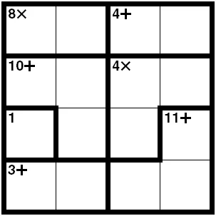

[Exercise Repo](https://github.com/Bryantellius/CSS-KenKen)

## Objective

Recreate the 4x4 KenKen Board below using the HTML elements given in the index.html file for this exercise. In the end, the KenKen board with resemble the picture, and users with have the ability to put number answers into each square. The board will also be responsive to all screen sizes.

## Exercise 1

Steps are to be completed by writing css rulesets in your `style.css` file.

1. Review the `index.html` file. Take note of the structure of the elements, class and id names.
2. Style the `body` to display the `width, height, margin, and background color` that you want. Remember that the body encapsulates everything on the webpage so this will affect all elements being displayed.

## Exercise 2

Steps are to be completed by writing css rulesets in your `style.css` file.

1. Create a ruleset in your `style.css` file that selects elements with the classname `grid`
2. Create a declaration that changes the **display** property of `grid` elements to `grid`
3. Create a declaration that changes the **grid-template-columns** property of `grid` elements to `repeat(4, 1fr)`
4. Create a declaration that changes the **grid-template-rows** property of `grid` elements to `repeat(4, 1fr)`

## Exercise 3

Steps are to be completed by writing css rulesets in your `style.css` file.

1. Create a ruleset in your `style.css` file that selects elements with the classname `grid-items`
2. Create a declaration that changes the **border** property of `grid-items` elements to `0.1rem solid gray`
3. Create a declaration that changes the **font size** property of `grid-items` elements to `2rem`
4. Create a declaration that changes the **background color** property of `grid-items` elements to `white`

## Exercise 4

Steps are to be completed by writing css rulesets in your `style.css` file.

1. Create a ruleset in your `style.css` file that selects elements with the following ids: `box3, box7, box10, box11, box12, box15`
2. Create a declaration that changes the **border left** property of the selected elements to `0.5rem solid black`

## Exercise 5

Steps are to be completed by writing css rulesets in your `style.css` file.

1. Create a ruleset in your `style.css` file that selects elements with the following ids: `box1, box2, box3, box4, box5, box8, box9, box10, box11`
2. Create a declaration that changes the **border bottom** property of the selected elements to `0.5rem solid black`

## Exercise 6

Steps are to be completed by writing css rulesets in your `style.css` file.

1. Create a ruleset in your `style.css` file that selects elements with the classname `prompt`
2. Create a declaration that changes the **position** property of the selected elements to `absolute`
3. Create a declaration that changes the **top** property of the selected elements to `0%`
4. Create a declaration that changes the **right** property of the selected elements to `0%`

## Exercise 7

Steps are to be completed by writing css rulesets in your `style.css` file.

1. Create a ruleset in your `style.css` file that selects elements with the classname `answer`
2. Create a declaration that changes the **width** property of the selected elements to `50%`
3. Create a declaration that changes the **height** property of the selected elements to `50%`
4. Create a declaration that changes the **text align** property of the selected elements to `center`

## Exercise 8

Steps are to be completed by writing css rulesets in your `style.css` file.

1. Create a ruleset in your `style.css` file that selects elements with the classname `special`
2. Create a declaration that changes the **border** property of the selected elements to `none`
3. Create a declaration that changes the **font size** property of the selected elements to `2rem`

## Exercise 9

Steps are to be completed by writing css rulesets in your `style.css` file.

1. Create a media query in your `style.css` file that will apply rulesets when the screen size is `min-width: 475px`
2. Create a ruleset in your media query that selects elements the `html` element
3. Create a declaration that changes the **font size** property of the `html` element to `16px`

## Exercise 10

> Post KenKen Exercise

1. Fully complete the [Flexbox Zombies Learning Game](https://mastery.games/flexboxzombies/) by David Geddes
