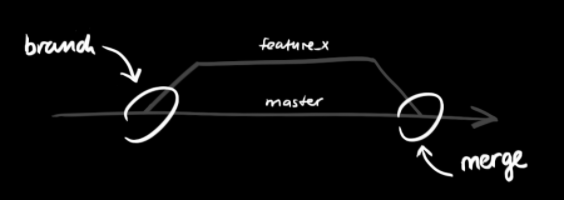

Lecture Video

<video width="100%" height="auto" controls>
  <source src="https://vimeo.com/499767209/214ca8778b" type="video/mp4" />
</video>

---

# Lecture

## Why:

In a collaborative environment, it is common for several developers to share and work on the same source code. While some developers will be fixing bugs, others will be implementing new features, etc. With so much going on, there needs to be a system in place for managing different versions of the same code base.

Branching allows each developer to branch out from the original code base and isolate their work from others. It also helps Git to easily merge versions later on.

What truly separates Git from other VCS is the fact it's distributed. Many of the prior VCSs like CVS and svn had branching but were centralized and couldn't be used offline

[Backlog Branch Tutorial](https://backlog.com/git-tutorial/using-branches/)

[Git Branching Documentation](https://git-scm.com/book/en/v2/Git-Branching-Branches-in-a-Nutshell)

## What:

### Feature Branches:

Branches are used to develop features **isolated** from each other.

The **master** branch is the default branch when you create a repository.

We'll use other branches for development and then merge those branches back to the master branch upon completion.



In this diagram below, we have two separate branches. Our Master Branch – which is our default branch – and our Feature branch. So we have two isolated lines of development:


By developing them in branches, it’s not only possible to work on both of them in parallel, but it also keeps the main master branch free from questionable code.

### Branching Steps:

To create a branch locally

You can create a branch locally as long as you have a cloned version of the repo.

- From your terminal window, **list** the branches on your repository.

  ```
  $ git branch
  master*
  ```

This output indicates there is a single branch, the master and the asterisk indicates it is currently active.

- Create a new feature branch in the repository

  `$ git branch <featureBranch>`

- Switch to the feature branch to work on it.

  `$ git checkout <featureBranch>`

You can list the branches again with the git branch command.

- Commit the change to the feature branch:

  ```
  $ git add .
  $ git commit -m "adding a change from the feature branch"
  ```

- Switch back to the master branch.

  `$ git checkout master`

- Push the feature branch to GitHub:

  `$ git push origin <feature branch>`

- View the **Source** page of your repository in GitHub. You should see both the master and the feature branch. When you select the feature branch, you see the **Source** page from that perspective. Select the feature branch to view its **Recent commits**.

### Switching Branches:

The **git checkout** command allows you to switch branches by updating the files in your working tree to match the version stored in the branch that you wish to switch to.

You can think of it as a way of switching between different workspaces.

### Merging Branches:

The merge command allows you to join two or more development histories together, such as a branch:

- Merges other-branch into the current branch

  `git merge branchName`

So if we want to merge our feature branch into our Master branch:

- Switch to our master branch

  `git checkout master`

- Make sure we have the latest version of master

  `git pull`

- Merge featureBranch into Master branch

  `git merge featureBranch`

Git Documentation:

[Git Handbook](https://git-scm.com/book/en/v2)

## How:

Let’s say you’ve been given the task of creating a new feature for an app. Instead of making a bunch of commits to our master branch and seeing if the new feature works or not, we can create a new branch (or development history) and see if the feature works there. If the feature doesn’t work, no harm no foul. If it does, we can eventually merge that branch into the master branch. Here we have avoided tainting our master branches timeline with mistakes.

Show an example of switching between 2 different branches and how each has differences that can eventually be merged.

---

## Exercise:

[Windows Exercise Walkthrough Documentation](https://docs.google.com/document/d/1ksajxQHGGR1-j52NGpfe-fvEccuipRWG3pFaE4T4kaE/edit?usp=sharing)

[Mac Exercise Walkthrough Documentation](https://docs.google.com/document/d/1Om6x0YGMh0-gZMvNanR_EWM6T5pH0V6xdj-iJ78W09E/edit?usp=sharing)

1. Interactive Tutorial:

   [https://www.katacoda.com/courses/git](https://www.katacoda.com/courses/git) ←complete scenario 6

   Topics covered in the tutorial:

   - git checkout, branching, merging, deleting branches

2. Using your Pizza Algorithm exercise, create a new branch named test:

   - Switch to the test branch and complete additional steps to your algorithm - for example, what if they send you the wrong order?
   - Commit your additional work and push the test branch to GitHub
   - Finally, we’ll switch to our local master branch and merge in the changes from the test branch to the master branch

### Steps for Exercise 2:

Using the PizzaAlgo repo from earlier:

In the Command prompt / Terminal:

1. Create a new branch named test

   `git branch test`

2. Check if any changes have been made

   `git status`

3. Switch to test branch with and do some work on test branch and save → add a step 1a for example

   `git checkout test`

4. Check if the Algo file has been modified in the test branch

   `git status`

5. Add those changes to the staging areas for test branch

   `git add .`

6. Commit those changes to test branch

   `git commit -m "reworded a step"`

7. Pushed test branch to the remote repository (GitHub)

   `git push origin test`

8. Switch to master branch

   `git checkout master`

9. Merge the changes in test branch to the master branch

   `git merge test`

---

## Quiz:

[Take the Git Branching and Merging Quiz](https://forms.gle/PukUudiDEdTrW2dY8)

<video width="100%" height="auto" controls>
  <source src="https://vimeo.com/470711832/17a657a350" type="video/mp4" />
</video>
