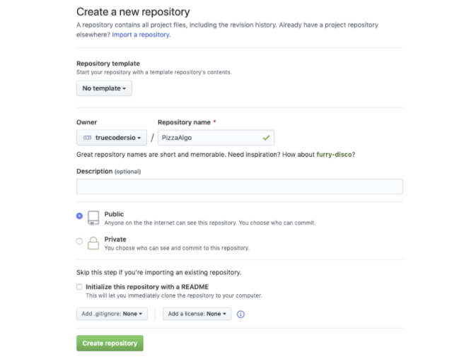
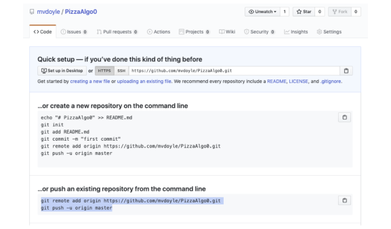

Lecture Video Part 1

<video width="100%" height="auto" controls>
  <source src="https://vimeo.com/499737170/cc52a139dc" type="video/mp4" />
</video>

Lecture Video Part 2

<video width="100%" height="auto" controls>
  <source src="https://vimeo.com/499800324/4231788a62" type="video/mp4" />
</video>

---

# Lecture

## Why:

We cover Git because it is a **Distributed Version Control System**. Distributed means there is no central server required, so work can be done “Offline” simultaneously with someone else also working offline. In the past, with traditional **Centralized Version Controls Systems**, two people editing a file was very difficult and sometimes whomever saved the file last would overwrite someone else's work.

[Git was created by Linus Torvalds in 2005 for development of the Linux kernel](https://www.linuxjournal.com/content/git-origin-story), with other kernel developers contributing to its initial development and is a [free and open-source software](https://en.wikipedia.org/wiki/Free_and_open-source_software).

Also:

While we are using Git, we will be using the command prompt / terminal a lot. Here is a great cheat sheet for those commands: [https://files.fosswire.com/2007/08/fwunixref.pdf](https://files.fosswire.com/2007/08/fwunixref.pdf)

**GitHub Cheat Sheet:**

[https://education.github.com/git-cheat-sheet-education.pdf](https://education.github.com/git-cheat-sheet-education.pdf)

## What:

**Version Control** is a means for managing your source code

Version Control allows you to:

- Access previous versions of your code (History of content changes)
- Have multiple working copies of your code
- Backing up your code is now trivial
- Share your work with other people easily and facilitates collaborative changes to files

Version Control Systems are usually represented with a tree data structure

**Git:**

A **[distributed version-control](https://en.wikipedia.org/wiki/Distributed_version_control) system (DVCS)** for tracking changes in [source code](https://en.wikipedia.org/wiki/Source_code) during [software development](https://en.wikipedia.org/wiki/Software_development). It is designed for coordinating work among [programmers](https://en.wikipedia.org/wiki/Programmer), but it can be used to track changes in any set of [files](https://en.wikipedia.org/wiki/Computer_file).

**Git != GitHub: _(Git is not the same as GitHub)_**

So while Git is a tool to manage your source code history, GitHub is a hosting service for Git repositories

Git is the tool, GitHub is a service for projects that use Git

GitHub is where our **Remote repository** will live. Our computer is where our Local repository will live. Once we have our project in a working state, we can push what’s in our Local repository to our Remote repository.

**Making Commits:**

The traditional software expression of "saving" is synonymous with the Git term "committing". **A commit is the Git equivalent of a "save".**

The **git commit** command captures a snapshot of the project's currently staged changes.

Each circle in the above diagram is a commit – a **snapshot** of the project

**Remote repositories:**

Versions of your project that are hosted on the Internet or network somewhere (like GitHub!).

Collaborating with others involves managing these remote repositories and **pushing** and **pulling** data to and from them when you need to share work.

With **Remote Repositories** we usually use these git commands:

**git clone** : puts a copy of the remote repository on our machine

**git push** : after we worked on the local version of the repository, we can push those changes to the remote

**git pull** : pulls the latest version of the remote repository to our machine. We use this after we have already cloned a copy of the remote repository to our local machine because someone else may have updated the remote in the meantime. So we want to make sure we have the most up to date version.

**Staging with git add:**

**git add &lt;filename>** - add a specific file to the staging area

**git add .** - add all modified files to the staging area. the period is what chooses all files

The **git add** command adds a change in the working directory to the **staging area**. It tells Git that you want to include updates to a particular file in the next commit. However, git add doesn't really affect the repository in any significant way—changes are not actually recorded until you run git commit.

**Moreover on Staging:**

Stage lets you group related changes into highly focused snapshots before actually committing it to the project history. This means you can make all sorts of edits to unrelated files, then go back and split them up into logical commits by adding related changes to the stage and commit them piece-by-piece.

**Workflow:**

Developing a project revolves around the basic **edit/stage/commit** pattern.

**Edit**

1.  Do work (edit your files in the working directory)

**Stage**

1.  When you’re ready to save a copy of the current state of the project, you can stage all your changes with:

**git add .**

**Commit**

1.  After you’re happy with the staged snapshot, you commit it to the project history with:

**git commit –m "a descriptive message"**

**Send to GitHub (remote repository) – git push -u origin (only for first push)**

1.  In addition to git add and git commit, a third command **git push** is essential for a complete collaborative Git workflow. **git push is utilized to send the committed changes to remote repositories for collaboration**. This enables other team members to access a set of saved changes.

**Basic Terminal/Git Bash Commands:**

**ls** - lists available directories for you to **cd** to

**cd directoryName** - change current directory to the specified directory

**touch fileName** - Create a file named fileName

**pwd** - prints your current directory

** code . **- opens an instance of VS Code at your current directory

**Basic Command Prompt(Windows) Commands:**

**dir** - lists available directories for you to **cd** to

**cd directoryName** - change current directory to the specified directory

**echo example > fileName** - Creates a file named **fileName** and writes **example** inside

**echo %cd%** - prints your current directory

** code . **- opens an instance of VS Code at your current directory

**Basic Git Commands:**

**For Mac: to show hidden files: cmd-shift-.**

**git init**: initializes a new repository in the current directory

**git status** : The git status command displays the state of the working directory and the staging area. It lets you see which changes have been staged, which haven't, and which files aren't being tracked by Git

**git add &lt;fileName>**: stages a file so it is ready to commit

**git add .**: stages all files in the directory so they are ready to commit

**git commit -m “this is my first commit”** : commits the changes in the currently staged files and includes a message

**git push** : tells git that you're ready to push your local changes. Just tell git where to push

**git push &lt;remote-name> &lt;branch-name>**

**git push -u origin main**

**git clone &lt;remote url>** : copy a remote repository to your local machine. Very collaborative

**git branch**: lists the branches in the repository

**git branch &lt;name>**: creates a new branch

**git checkout &lt;name>:** switches to a specific branch

**git checkout –b &lt;name>: creates a new branch, and switches to that branch at the same time**

**git merge &lt;name>** : merges a specific branch into the current branch

**git pull**: downloads content from a remote repository and immediately update the local repository to match that content

**git log:** display our commit history

**git diff: **enables you to compare changes in the working directory against a previously committed version

**git config --global user.email "[you@example.com](https://meet.google.com/linkredirect?authuser=0&dest=mailto%3Ayou%40example.com)"**

**git config --global user.name "Your Name"**

**Git Documentation:**

[https://git-scm.com/book/en/v2](https://git-scm.com/book/en/v2)

---

## Exercise:

[Windows Exercise Walkthrough Documentation](https://docs.google.com/document/d/1KtSjsFNv_XmiY9rvSN93BzmCUmlIlwgcfTVeRMLOyHw/edit?usp=sharing)

[Mac Exercise Walkthrough Documentation](https://docs.google.com/document/d/1aoUouylRs9ZeRDrRq96pdtpAZNKFfWRSUzbkFrBxhIg/edit?usp=sharing)

1. **Online Tutorial: Complete Scenario 1:**

[https://www.katacoda.com/courses/git](https://www.katacoda.com/courses/git)
Complete Scenario 1

**https://vimeo.com/449361446/b36121e1a2**

**Topics covered in the tutorial:**

git init, git status, untracked files, git add, git commit -m “message”, gitignore, git diff, git diff --staged, git log

**Use this video to help guide you through the exercise 2**

How to Video

<video width="100%" height="auto" controls>
  <source src="https://vimeo.com/501605388/9f41d9d902" type="video/mp4" />
</video>

<!-- [How to Video](https://vimeo.com/501605388/9f41d9d902) -->

2. Work with git on a simple pizza delivery algorithm file that covers the steps involved with ordering a pizza, and show how cool git can be with backing up our work.

   1. Open terminal / command prompt on your computer
   2. Set your name and email in git
      - git config --global user.name "_Mona Lisa_"
      - git config --global user.email "_email@example.com_"
   3. Create a folder named repos on your computer (_this is where we will save all of our projects throughout the course_) → mkdir repos
   4. cd into your repos folder → cd repos
   5. Inside of your repos folder, create a folder named PizzaAlgo

   - mkdir PizzaAlgo

   6. cd into that folder with terminal / command prompt → cd PizzaAlgo
   7. Initialize that folder as a git repository → git init
   8. Your terminal / command prompt will look something like this:

Continue to next steps below

Visual Studio Code is shown in the image above

9. Using the Visual Studio Code application, create a new file named Algo inside of your PizzaAlgo folder and save it.

10. Now we will add instructions for ordering pizza in this file

11. Use git to commit your changes as you add steps to the file

    - git add .
    - git commit -m “added order step”

Continue to steps below

12. Once your commits are ready, go to github and create a new EMPTY repository named PizzaAlgo

- Use the ‘new’ button on github

Your new repository should resemble the image above

Continue to the next steps below

You will see a page that looks like this once created:

Copy the text from that page as you see above ^^

13. Go back to terminal/command prompt, paste the text you copied from github and hit enter
14. Your github repository should now contain the Algorithm you worked on from your computer

Example ANSWER:

[https://github.com/mvdoyle/PizzaAlgo](https://github.com/mvdoyle/PizzaAlgo)

---

## Quiz:

[Take the Git Intro Quiz](https://forms.gle/AH2jspgH6tUWucue7)

Quiz Walkthrough Video:

<video width="100%" height="auto" controls>
  <source src="https://vimeo.com/499770313/3e5d97d45d" type="video/mp4" />
</video>

---

## Work Cited:

[Git Handbook](https://git-scm.com/book/en/v2/Getting-Started-About-Version-Control)

[GitHub Cheat Sheet:](https://education.github.com/git-cheat-sheet-education.pdf)

[LearnEnough - Getting Started Documentation and Tutorial](https://www.learnenough.com/git-tutorial/getting_started)
