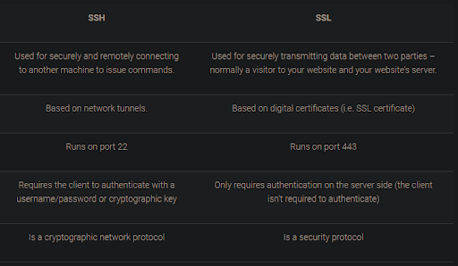
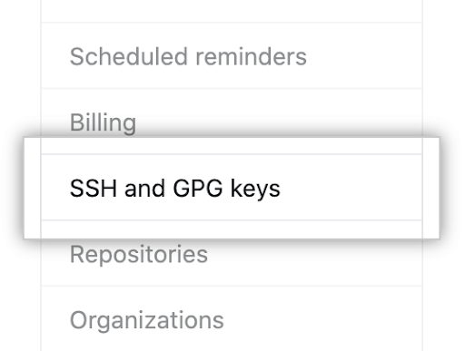
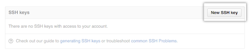
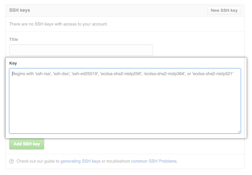
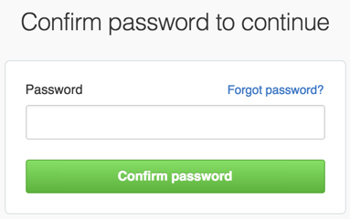

<!-- Lecture Video

<video width="100%" height="auto" controls  poster="../assets/lectures/git/ssh-key-setup-thumbnail.gif">
  <source src="https://vimeo.com/589938750" type="video/mp4" />
</video>

--- -->

## Why

One of the most important, yet often overlooked actions, is setting up your SSH Keys for a secure connection to Github. Through HTTPS you can clone and pull repositories without the need for authentication, but every time you push to Github you must provide your github password. And with your password and username compromised, all of your repositories can now be deleted, overwritten, or just messed around with. And NOBODY likes that!

## What

So, before we get to the actual setup of the SSH Key, let’s first define HTTPS & SSH and then list some of the pros and cons of each method.

### HTTPS

Hypertext Transfer Protocol Secure (HTTPS) is an extension of the Hypertext Transfer Protocol (HTTP). It is used for secure communication over a computer network, and is widely used on the Internet. In HTTPS, the communication protocol is encrypted using Transport Layer Security (TLS) or, formerly, Secure Sockets Layer (SSL). The protocol is therefore also referred to as HTTP over TLS, or HTTP over SSL.

The principal motivations for HTTPS are authentication of the accessed website, and protection of the privacy and integrity of the exchanged data while in transit. It protects against man-in-the-middle attacks, and the bi-directional encryption of communications between a client and server protects the communications against eavesdropping and tampering. The authentication aspect of HTTPS requires a trusted third party to sign server-side digital certificates.

**SSH**: Secure Shell (SSH) is a cryptographic network protocol for operating network services securely over an unsecured network. Typical applications include remote command-line, login, and remote command execution, but any network service can be secured with SSH.

SSH provides a secure channel over an unsecured network by using a client–server architecture, connecting an SSH client application with an SSH server. The protocol specification distinguishes between two major versions, referred to as SSH-1 and SSH-2. The standard TCP port for SSH is 22. SSH is generally used to access Unix-like operating systems, but it can also be used on Windows. Windows 10 uses OpenSSH as its default SSH client and SSH server.

SSH was designed as a replacement for Telnet and for unsecured remote shell protocols such as the Berkeley rsh and the related rlogin and rexec protocols. Those protocols send sensitive information, notably passwords, in plaintext, rendering them susceptible to interception and disclosure using packet analysis. The encryption used by SSH is intended to provide confidentiality and integrity of data over an unsecured network, such as the Internet.

### Summary



### HTTPS Pros

- It is easiest to set up on the widest range of networks and platforms and is easier for people to get started in a simple and secure way.
- It does not require to generate/copy/paste ssh keys in the git server provider.
- It is easier to access and write to repositories from anywhere and you just need account details.
- HTTPS is a port that is open in all firewalls and does not require you to open it up manually by having to mess around with the firewall settings.

### HTTPS Cons

- You have to enter the Github password every time you push.
  - But you can set it to store it permanently using windows credentials in the windows machine. So the credential.helper will cache your password with an HTTPS link. However, if the user changes their password, they must reconfigure everything from scratch.
- If your Github/bitbucket/GitLab account (username and password) is stolen then your GitHub/bitbucket/GitLab account can be changed and blocked by them from accessing all your git repositories and even can delete all your repositories.
  - If you have two-factor authentication enabled (2FA), you will have to use a personal access token (PAT) instead of your regular standard password. If you have enabled Two Factor Authentication, git will prompt you to have a code on your mobile device(s) or send it as a text message after successfully entering your username and password.

### SSH Pros

- Using the SSh key is more secure than using a password.
- No repetitive authentication is required as with HTTPS. For every action that you perform, SSH removes the burden of authenticating on your remote server for every action (clone/push/pull) in git. This is one of the major reasons why SSH is preferable to HTTPS.
- Since no password is required for SSH, the hassle of two-factor authentication is not needed. Whoever has your private key can push to your repositories without needing a code-generating device.
- If your private key is stolen, someone can do a force push to new empty repositories and remove all change records and history for every repository you have, but they (the hacker) cannot change anything in your GitHub account. It is much easier to restore your GitHub account from this hack.

### SSH Cons

- One minor drawback is that all connections require authentication, so you always need a Github account -even for cloning and pulling repositories
  - but you can store a key so that it will not ask.
- Networks and Firewalls sometimes refuse to allow SSH connections (port 22). But even if SSH port access is denied, most firewalls allow you to easily re-configure SSH to work over HTTPS. (port 443)

## How

### Windows SSH Key instructions

Make sure **Git** is installed on your computer BEFORE going any further!

[Git Installation Walkthrough](https://vimeo.com/438678226)

After you have finished installing Git:

- Open a terminal / command prompt / git bash on your computer
- Set your name and email in git

  - git config --global user.name "Your Name"
  - git config --global user.email "email@example.com"

- Set your default git branch to main (We’ll get into branching in the next lecture!)

  - git config --global init.defaultBranch main

- Next we need to generate an SSH Key to authenticate our connection to GitHub.
- Copy the text below and paste it in the _git bash_

```sh
ssh-keygen -t ed25519 -C "_your_email@example.com_"
```

> Note that you’ll need to replace “your_email@example.com” with your email that you used to create your github account. - When you're prompted to "Enter a file in which to save the key," press Enter. This accepts the default file location.

- At the prompt below, type a secure passphrase.

```sh
Enter passphrase (empty for no passphrase): [Type a passphrase]
Enter same passphrase again: [Type passphrase again]
```

- When you're prompted to "Enter a file in which to save the key," press Enter. This accepts the default file location.
- Next, let's start the ssh-agent in the background. Paste the first line below in the terminal, the second line is what you’re expecting the terminal to say back to you.

```sh
eval `ssh-agent -s`
Agent pid 59566 (number might be different)
```

- Add your SSH private key to the ssh-agent. If you created your key with a different name, or if you are adding an existing key that has a different name, replace id_ed25519 in the command with the name of your private key file.

```sh
ssh-add ~/.ssh/id_ed25519
```

Now we need to get our newly generated SSH connected to our GitHub account.

- Copy the SSH public key from your terminal. Paste the code below in your terminal, and it’ll copy the SSH Key.

```sh
clip > ~/.ssh/id_ed25519.pub
```

- Tip: If clip isn't working, you can locate the hidden .ssh folder, open the file in your favorite text editor, and copy it to your clipboard.
- Go to [GitHub](https://github.com/). In the upper-right corner of any page, click your profile photo, then click Settings.


- In the user settings sidebar, click SSH and GPG keys.



- Click New SSH key or Add SSH key.



- In the "Title" field, add a descriptive label for the new key.
- Paste your key into the "Key" field.



- Click Add SSH key.


- If prompted, confirm your GitHub password.



### Mac SSH Key instructions

- Open terminal / command prompt / git bash on your computer
- Set your name and email in git

```sh
git config --global user.name "Your Name"
git config --global user.email "email@example.com"
```

- Set your default git branch to main (We’ll get into branching in the next lecture!)

```sh
git config --global init.defaultBranch main
```

- Next we need to generate an SSH Key to authenticate our connection to GitHub.
- Copy the text below and paste it in the _git bash_

```sh
ssh-keygen -t ed25519 -C "_your_email@example.com_"
```

> Note that you’ll need to replace “[your_email@example.com](mailto:your_email@example.com)” with your email that you used to create your github account.

- When you're prompted to "Enter a file in which to save the key," press Enter. This accepts the default file location.
- At the prompt below, type a secure passphrase.

```sh
Enter passphrase (empty for no passphrase): [Type a passphrase]
Enter same passphrase again: [Type passphrase again]
```

- Next, let's start the ssh-agent in the background. Paste the first line below in the terminal, the second line is what you’re expecting the terminal to say back to you.

```sh
eval "$(ssh-agent -s)"
Agent pid 59566
```

- If you're using macOS Sierra 10.12.2 or later, you will need to modify your ~/.ssh/config file to automatically load keys into the ssh-agent and store passphrases in your keychain.
- First, check to see if your ~/.ssh/config file exists in the default location. Paste the first line below in the terminal, the second line is what you’re expecting the terminal to say back to you.

```sh
open ~/.ssh/config
```

- The file `/Users/_you_/.ssh/config` does not exist.
- If the file doesn't exist, create the file. Paste the text below into your terminal.

```sh
touch ~/.ssh/config
```

- Open your `~/.ssh/config` file by typing `open ~/.ssh/config`, then copy and paste the lines below into the file.

```sh
Host *

AddKeysToAgent yes

UseKeychain yes

IdentityFile ~/.ssh/id_ed25519
```

- Add your SSH private key to the ssh-agent and store your passphrase in the keychain. Paste the text below into your terminal.

```sh
ssh-add -K ~/.ssh/id_ed25519
```

Now we need to get our newly generated SSH connected to our GitHub account.

- Copy the SSH public key from your terminal. Paste the code below in your terminal, and it’ll copy the SSH Key.

```sh
pbcopy > ~/.ssh/id_ed25519.pub
```

- Tip: If pbcopy isn't working, you can locate the hidden .ssh folder, open the file in your favorite text editor, and copy it to your clipboard.

- Go to [GitHub](https://github.com/). In the upper-right corner of any page, click your profile photo, then click Settings.


- In the user settings sidebar, click SSH and GPG keys.


- Click New SSH key or Add SSH key.


- In the "Title" field, add a descriptive label for the new key.
- Paste your key into the "Key" field.


- Click Add SSH key.


- If prompted, confirm your GitHub password.


## Exercise

No Exercise!
