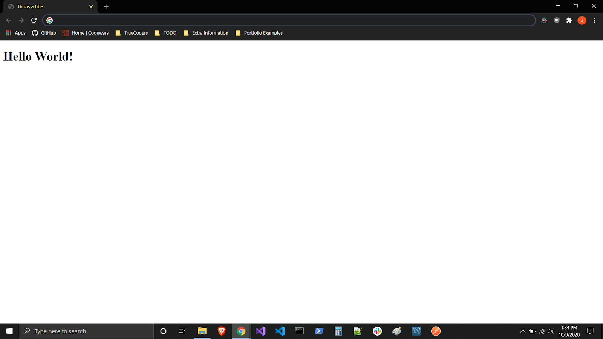
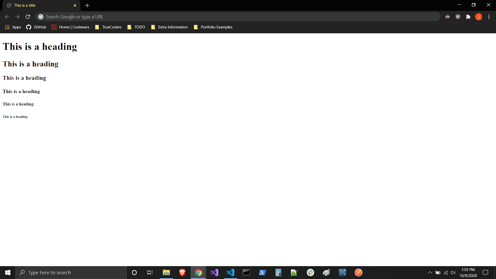
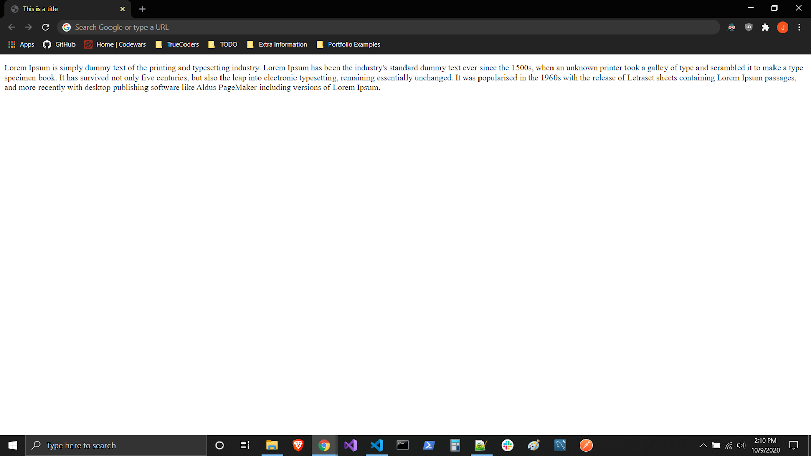
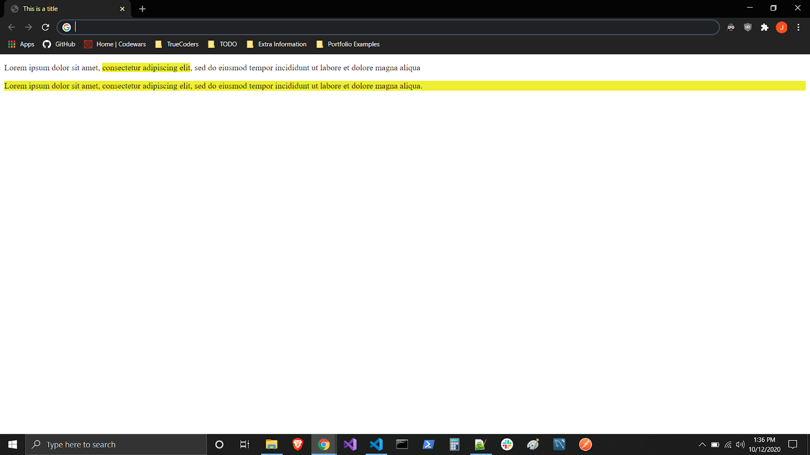

## Why

**HyperText Markup Language**, or **HTML**, is the official language of the World Wide Web and was first widely introduced in 1990. HTML was originally created to allow those who were not specialized in SGML (Standard Generalized Markup Language) to publish and exchange scientific and other technical documents. HTML especially facilitated this exchange by incorporating the ability to link documents electronically using hyperlinks. Hypertext documents are interconnected by hyperlinks, which are typically activated by a mouse click, keypress, or by touching the screen. The first publicly available description of HTML was a document called “HTML Tags”, first mentioned on the Internet by Tim Berners-Lee in late 1991. It describes 18 elements comprising the initial, relatively simple design of HTML.

## What

So what is a markup language anyways? In computer text processing, a **markup language** is a system for annotating a document noticeably different from the text. When the document is processed for display, the markup language is not shown, and is only used to format the text. The following is an example of the classic "Hello World" program:

```html
<!DOCTYPE html>
<html>
  <head>
    <title>This is a title</title>
  </head>
  <body>
    <div>
      <h1>Hello World!</h1>
    </div>
  </body>
</html>
```

The HTML above will display "Hello world!" on the webpage. The text "This is a title" is in the head element and therefore will not be shown. Using the correct markup is important in conveying the correct semantic meaning of your text. Is this text a link? Is that text a source to display an image? Is this text supposed to be a heading? Is that paragraph related to the article? Semantic meaning answers all of those questions.



## How

HTML documents are files that end with a `.html` or `.htm` extension. You can view them using any web browser (such as Google Chrome, Safari, or Mozilla Firefox). To open an HTML file double click on that file (with either a `.html` or `.htm` extension) and it will open up in your browser.


> You can also open you command prompt and type `start index.html`, replacing `index.html` with the actual file path, and it will launch your default browser with the html file loaded
> If you are using a Mac, open the terminal and type `open index.html` for the same result

The **Document Object Model** (**DOM**) is the data representation of the objects that comprise the structure and content of a document on the web.The Document Object Model (DOM) is a programming interface for HTML and XML documents. It represents the page so that programs can change the document structure, style, and content. The DOM represents the document as nodes and objects. That way, programming languages can connect to the page.

A Web page is a document.This document can be either displayed in the browser window or as the HTML source. But it is the same document in both cases. The Document Object Model (DOM) represents that same document so it can be manipulated. The DOM is an object-oriented representation of the web page. Each HTML page consists of a set of **tags** (also called **elements**), which you can refer to as the building blocks of web pages. They create a hierarchy that structures the content into sections, paragraphs, headings, and other content blocks. Most HTML elements have an opening and a closing that use the `<tag></tag>` syntax. HTML tags have two main types: **block-level** and **inline tags**.

- **Block-level elements** take up the full available space and always start a new line in the document. Headings `<h1></h1>` and paragraphs `<p></p>` are a great example of block tags.
- **Inline elements** only take up as much space as they need and don’t start a new line on the page. They usually serve to format the inner contents of block-level elements. Links and emphasized strings are good examples of inline tags.

### Block-Level Tags

The three block level tags every HTML document needs to contain are `<html>`, `<head>`, and `<body>`.

- The `<html></html>` tag is the highest level element that encloses every HTML page.
- The `<head></head>` tag holds meta information such as the page’s title and charset.
- The `<body></body>` tag encloses all the content that appears on the page.

```html
<html>
  <head>
    <!-- Meta Information Goes Here -->
  </head>
  <body>
    <!-- Page Content Goes Here -->
  </body>
</html>
```

The Heading tags, `<h1></h1>`, are another common block-level tag and they range from `<h1></h1>` to `<h6></h6>`. The h1 tag is the largest and the h6 tag is the smallest.



The Paragraph tag, `<p></p>`, is used to enclose text



The Division tag, `<div></div>`, is a container which usually contains several other HTML elements within it, even including other div tags (nesting elements within elements).

```html
<div>
  <h1>HTML Heading</h1>
  <div>
    <p>Lorem ipsum...</p>
  </div>
</div>
```

### Inline Tags

Inline elements don't take up all the width like block level elements and they do not start new lines unlike block level ones. A common inline element is a `<span></span>`

> NOTE: With a `span` element we can format text inline without causing a line break, destroying the document's flow.



Many inline tags are used to format text. For example, a `<strong></strong>` tag would render an element in `bold`, whereas `<em></em>` tags would show it in _italics_. Hyperlinks are also inline elements that require `<a></a>` tags and `href` attributes to indicate the link’s destination:

```html
<div>
  <a href="https://truecoders.io/">TrueCoders</a>
</div>
```

Images are inline elements too. You can add one using `` without any closing tag. But you will also need to use the `src` attribute to specify the image path, for example:

```html

```

For a comprehensive list of all HTML tags [w3schools](https://www.w3schools.com/tags/).

### HTML Attributes

HTML attributes are additional values that configure the elements or adjust their behavior in various ways to meet the criteria the users want. All HTML elements can have attributes and they are always specified in the start tag. Attributes usually come in name/value pairs like: `name="value"`.

- The `href` Attribute - The `<a>` tag defines a hyperlink. The href attribute specifies the URL of the page the link goes to:

```html
<a href="https://truecoders.io/">TrueCoders</a>
```

- The `src` Attribute - The `` tag is used to embed an image in an HTML page. The src attribute specifies the path to the image to be displayed:

```html

```

- The `title` Attribute - The title attribute defines some extra information about an element. The value of the title attribute will be displayed as a tooltip when you mouse over the element:

```html
<p title="I'm a tooltip">This is a paragraph.</p>
```

- The `lang` Attribute - You should always include the `<html>` tag, to declare the language of the web page.

This is meant to assist search engines and browsers. Example of english as the language:

```html
<!DOCTYPE html>
<html lang="”en”">
  <body></body>
</html>
```

For a comprehensive list of all HTML attributes for each element check out: [https://www.w3schools.com/tags/ref_attributes.asp](https://www.w3schools.com/tags/ref_attributes.asp)

## Takeaways

1. HTML is a markup language that adds semantic meaning to text on a webpage
2. HTML Elements can be broken up into _inline_ or _block_
3. HTML Elements are made up of _tags_ (`<tag>`), _children_ (`<tag>...children...</tag>`), and _attributes_ (`<tag attribute="value">`)
