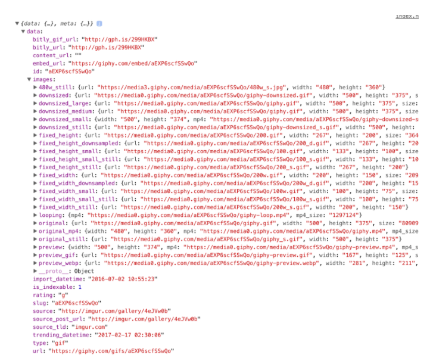

Lecture Video 1

<video width="100%" height="auto" controls>
  <source src="https://vimeo.com/504984084/bee103445e" type="video/mp4" />
</video>

Lecture Video 2

<video width="100%" height="auto" controls>
  <source src="https://vimeo.com/509030596/8cb3bd8ba2" type="video/mp4" />
</video>

# Lecture

## Why:

One of the most powerful things a web developer can do is fetching data from a server and displaying it creatively on their site. In many cases, the server solely exists for that specific site. The server could contain blog posts, user data, high scores for a game or anything else. In other cases, the server is an open service that serves data to anyone that wants to use it (i.e. weather data or stock prices). In either case, the methods of accessing and then using that data are essentially the same.

## What:

### APIs

**_Servers that are created for serving data for external use (in websites or apps) are often referred to as APIs or ‘Application Programming Interfaces’_**.

There are multiple ways of requesting data from an API, but all of them basically do the same thing. For the most part, APIs are accessed through URLs, and the specifics of how to query these URLs changes based on the specific service you are using. For example, the OpenWeatherMap API has several types of data that you can request. To get the current weather in a specific location, you need to request data from this URL:

`https://api.openweathermap.org/data/2.5/weather?q=hoover,al`

You’ll want to switch out the city for the location you’re requesting. The specifics for using any API are usually documented on the service’s website. [Check here for the OpenWeatherMap API documentation](https://openweathermap.org/current).

If you haven’t already, go ahead and paste the weather URL above into your browser…(we’ll wait).

Unless the implementation of that specific API has changed, you probably get an error like this:

`{"code":401, "message": "Invalid API key. Please see http://openweathermap.org/faq#error401 for more info."}`

This brings us to another point about APIs. **_In most cases, you have to sign up and get an API key to use them_**. Obtaining the API key is as simple as signing up on their website and using it is usually as easy as pasting it into the URL:

`http://api.openweathermap.org/data/2.5/weather?q=Hoover,al&APPID=1111111111`

(exactly how to include the key changes from service to service)

Services like the OpenWeatherMap use API keys to track who is requesting the data they serve, and how much data they are requesting. The reason they do this is so that people can’t take advantage of their service. Running servers, especially large ones, costs money, and while each current weather request (or whatever) is relatively cheap, if the amount of requests gets too high the cost could be significant. Imagine using that API to create an amazing weather app that gets used all over the world….you could easily have thousands of people accessing that data every minute!

By signing up for a service and getting an API key you are letting the service track how much you are actually using. In many cases services are limited as to how much data they can request for free. With the weather app example, their free plan only allows you to make 60 requests per minute and also limits what types of data you can access ([details here if you’re interested](https://openweathermap.org/price)). So, if your app became successful, you would probably need to pay for a better account.

## How:

Luckily for us, the majority of our apps are only going to be used by us and the people that view our portfolios. So we’ll get by _just fine_ with free services.

Once you get a key and have waited for its activation you can paste the URL into the browser again (including your key of course) and hopefully, you’ll see a proper response:

```
{"coord":{"lon":-77.73,"lat":38.77},"weather":[{"id":800,"main":"Clear","description":"clear sky","icon":"01d"}],"base":"stations","main":{"temp":75.74,"pressure":1017,"humidity":57,"temp_min":71.6,"temp_max":78.8},"visibility":16093,"wind":{"speed":3.87,"deg":291},"clouds":{"all":1},"dt":1504188900,"sys":{"type":1,"id":2886,"message":0.0053,"country":"US","sunrise":1504175992,"sunset":1504222878},"id":4775660,"name":"New Baltimore","cod":200}
```

### Fetching Data

So how do we actually get the data from an API into our code?

A couple of years ago the main way to access API data in your code was using an **_XMLHttpRequest_**. This function still works in all browsers, but unfortunately, it is not particularly nice to use. The syntax looks something like this:

```
// Just getting XHR is a mess!
if(window.XMLHttpRequest) {
    request = new XMLHttpRequest();
} else if(window.ActiveXObject) {
    try {
        request = new ActiveXObject("Msxml2.XMLHTTP");
    } catch(error) {
        try {
            request = new ActiveXObject("Microsoft.XMLHTTP");
        } catch(error) {
            // attend to the error
        }
    }
}

// Open, send ...
request.open("GET", "https://url.com/some/endpoint", true);
request.send(null);
```

Developers, feeling the pain of having to write that stuff out, began writing 3rd party libraries to take care of this and make it much easier to use. Some of the more popular libraries are [axios](https://github.com/mzabriskie/axios) and [superagent](https://github.com/visionmedia/superagent), both of which have their strengths and weaknesses. More recently, however, web browsers have begun to implement a new native function for making HTTP requests, and that’s the one we’re going to use and stick with for now. Meet **_fetch_**:

```
//URL (required), options (optional)
fetch("http://url.com/some/endpoint")
    .then(function(response) {
        // Successful response
    })
    .catch(function(error) {
        // Error
    })
```

In case you’ve forgotten, scroll back up and look at how you would use XHR to do the same thing. While you’re admiring how nice and clean that code is, notice the .**_then_**() and .**_catch_**() functions there. Do you remember what those are? (PROMISES!)

Let’s change up our API for this example. We’re going to walk through an example using fetch with the [giphy](https://giphy.com/) API to display a random gif on a webpage. The API requires you to sign up and get a free API key, so go ahead and [do that here](https://developers.giphy.com/docs/).

Giphy has several methods for searching and finding gifs which you can read about in their documentation. Today we’re just going to use the ‘translate’ endpoint because it’s the simplest one for our purposes. You can find the appropriate URL in their documentation by scrolling down [here](https://developers.giphy.com/docs/). What it tells us is that the correct URL is api.giphy.com/v1/gifs/translate and that it requires 2 parameters, your api_key and a search term. If you put it all together correctly (with YOUR API key) you should get something like this:

`https://api.giphy.com/v1/gifs/translate?api_key=YOUR_API_KEY&cats`

Go ahead and try that URL (with YOUR API key) in a browser. If everything goes well you should get a relatively long string of data and no errors.

### CORS

A side note before we start putting this into our code. For security reasons, by default, browsers restrict HTTP requests to outside sources (which is exactly what we’re trying to do here). There’s a very small amount of setup that we need to do to make fetching work. Learning about this is outside our scope right now, but if you want to learn a bit about it this [Wikipedia article](https://en.wikipedia.org/wiki/Cross-origin_resource_sharing) is a decent starting point.

Whether or not you took the detour to learn all about Cross Origin Resource Sharing (CORS) the fix is simple. With fetch, you are able to easily supply a JavaScript object for options. It comes right after the URL as a second parameter to the fetch function:

```
fetch("https://url.com/url", { mode: "cors"});
```

Simply adding the {mode: 'cors'} after the URL, as shown above, will solve our problems for now. In the future, however, you may want to look further into the implications of this restriction.

### Let’s Do This - Giphy API

For now, we’re going to keep all of this in a single HTML file. So go ahead and create one with a single blank image tag and an empty script tag in the body.

```
<!DOCTYPE html>
<html>
    <head>
        <meta charset="UTF-8">
        <title>Document</title>
    </head>
    <body>
        
        <script>
        ...
        </script>
    </body>
</html>
```

In the script tag, let’s start by selecting the image and assigning it to a variable so that we can change the URL once we’ve received it from the Giphy API.

```
<script>
    const img = document.querySelector("img");
</script>
```

Adding fetch with our URL from above is also relatively easy:

```
<script>
    const img = document.querySelector("img");
    fetch("https://api.giphy.com/v1/gifs/translate?api_key=YOUR_API_KEY&s=cats", { mode: "cors"})
        .then(function(response) {
            console.log(response.json());
        });
</script>
```

You should now be able to open the HTML file in your browser, and while you won’t see anything on the page, you _should_ have something logged in the console. The trickiest part of this whole process is deciphering how to get to the data you desire from the server’s response. In this case, inspecting the browser’s console will reveal that what’s being returned is _another_ Promise… to get the data we need another .then() function.

```
<script>
    const img = document.querySelector("img");
    fetch("https://api.giphy.com/v1/gifs/translate?api_key=YOUR_API_KEY&s=cats", { mode: "cors"})
        .then(function(response) {
            return response.json();
        })
        .then(function(response) {
            console.log(response);
        });
</script>
```

Now we have a JavaScript object and if you inspect it closely enough you’ll find that the data we need (an image URL) is nested rather deeply inside the object:



To get to the data we need to drill down through the layers of the object until we find what we want!

```
<script>
    const img = document.querySelector("img");
    fetch("https://api.giphy.com/v1/gifs/translate?api_key=YOUR_API_KEY&s=cats", { mode: "cors"})
        .then(function(response) {
            return response.json();
        })
        .then(function(response) {
            console.log(response.data.images.original.url);
        });
</script>
```

Running the file should now log the URL of the image. All that’s left to do is set the source of the image that’s on the page to the URL we’ve just accessed:

```
<script>
    const img = document.querySelector("img");
    fetch("https://api.giphy.com/v1/gifs/translate?api_key=YOUR_API_KEY&s=cats", { mode: "cors"})
        .then(function(response) {
            return response.json();
        })
        .then(function(response) {
            img.src = response.data.images.original.url;
        });
</script>
```

If all goes well, you should see a new image on the page every time you refresh!

### Exercise

[Repo](https://github.com/Bryantellius/JavaScript_APIs)

Let's play around with API calls to Giphy

1. Open your index.html
2. Beneath the p tag, but before the img tag, add a Label, input, and button.
3. Feel free to label and style
4. Open your app.js
5. Add an event listener to the button that listens for a click event, and does the following:
   - Selects the img element and assigns it to a variable
   - Selects the input element, grabs the value from the element, and assigns it to a variable
   - Then, write a fetch request to "[https://api.giphy.com/v1/gifs/translate?api_key=YOURAPIKEY&s=](https://api.giphy.com/v1/gifs/translate?api_key=YOURAPIKEY&s=)"
   - Chain another .then that takes the result and assigns the image URL of the response object to the image tag source
   - Add the .catch method that accepts a callback that console.log's the rejection (if any)
6. If you have added the event listener correctly, and correctly called the Giphy API, then you will be able:
   - Let the user input any keyword to the input box
   - Let the user press the button
   - And display a gif in the image tag depending on the API response for the keyword

Exercise Walkthrough

<video width="100%" height="auto" controls>
  <source src="https://vimeo.com/509030724/6f95f03593" type="video/mp4" />
</video>

[Exercise WalkThrough Here](https://docs.google.com/document/u/1/d/1N7nS0hDFAQyJMFpTXjUo_lWAwSxuzatH8x__jsxaT9c/edit)

## Quiz:

[JavaScript APIs Quiz](https://forms.gle/LARgE5w2ykTp9BeM6)

<video width="100%" height="auto" controls>
  <source src="https://vimeo.com/510425267/792d06ae25" type="video/mp4" />
</video>
