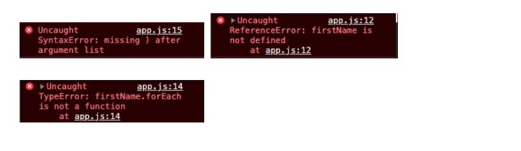
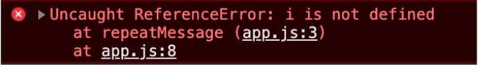

Lecture Video

<video width="100%" height="auto" controls>
  <source src="https://vimeo.com/508155630/eb581665ce" type="video/mp4" />
</video>

# Lecture

## Why:

We’ve been learning our way through the JavaScript language, and by now we’ve encountered an error or three.



Mistakes in code are referred to as **_bugs_**. The JavaScript language is loosely written, so the computer will not usually throw many errors.

If you:

- Write code that doesn’t follow JavaScript grammar
- Try to call something that is not a function
- Try to access a property from undefined

Your computer will usually throw an error. Other than that, you may never know anything is wrong until you get an unexpected **_undefined_** value.

Often, you will be spending time finding and fixing mistakes in your program. This is called **_debugging_**. We’ve already encountered errors, so we’ve already been debugging our code.

Composing error-free code is always the goal, but you need to pay special attention in JavaScript. Flagging mistakes and errors in your code is essential. Unfortunately, JavaScript can be extremely vague when you come across bugs in your code.

So let’s break down the best approach to error handling in JavaScript.

## What:

### Strict Mode

You can enable **_strict mode_** at the top of a file or function declaration for a slightly stricter run of JS code.

Place `“use strict”;` either at the top of a code file or a function body, and it will report more bugs/errors in your program.

```
"use string";
function repeatMessage(message = "Hello World", repeat = 1) {
    for(i = 0; i < repeat; i++) {
        console.log(message);
    }
}

repeatMessage();
```



Here we see an example of **Strict Mode** catching an error that JavaScript would solve during run time. JavaScript would create a _global variable_ for i (let i;) and use that global variable without throwing an exception.

Strict mode eliminates the ability to pass multiple parameters of the same name to a function.

### Types

- It is helpful to know what data types you expect to use with bindings, parameters, and function returns
- Since JavaScript evaluates types at runtime, and even then will implicitly convert types to what it expects itself, many bugs can occur
- There are several conventions for annotating JS code:

`//(number, number) => number`

Or you can use [TypeScript](https://www.typescriptlang.org/)

### Debugging

- Analyze your code before random changes
- Console.log to see/create a visual of the error occurring
- Use the debugger keyword to make the browser create a breakpoint in the code for inspection

### Error Propagation

- Remember that many end cases for the programs you write are used by someone(s) else.
- With that in mind, you need to write code that corrects user error, either by checking for it, running with it, or simply telling the user that something went wrong.

### Exceptions

- Exceptions allow code that runs into a problem to raise (or throw) an exception. An exception can be any value.
- Use the `throw` keyword to raise an exception (e.g., throw Error(“Something went wrong”))
- JS has an Error constructor that sets a message property on the created object
- Error objects also contain a _stack-trace_
- Catch the exception with a try/catch block that tries code and does something if an exception is caught

#### Cleaning Up After Exceptions

To reduce side effects, try writing code that creates new values rather than modifying existing values

Try/catch blocks have a try/catch/**_finally_** feature to run code after the exception catch no-matter-what

#### Selective Catching

Often, you will want to identify certain exceptions that you expected over those unexpected

You can create a `class [SpecificType]Error extends Error {}` and then use `error instanceof [SpecificType]Error` in your catch block

## How

Let’s take a look at an example application that allows you to **input** a message, specify how many times you want that message to be **repeated**, and **logs** the message to the **console**.

```
"use strict";
let userMessage;
let repeatMessageThisManyTimes;

class UserInputError extends Error {}

function takeUserInput() {
    userMessage = prompt("Please enter a message:");
    do {
        try {
            userMessage = Number(prompt("How many times would you like your message to be repeated?"));
            if(!repeatMessageThisManyTimes) {
            throw new UserInputError("Not a Number");
            }
        } catch(error) {
            console.log(error.message);
        }
    } while(!repeatMessageThisManyTimes);
}

takeUserInput();

function repeatMessage() {
    for(let i = 0; i < repeatMessageThisManyTimes; i++) {
        console.log(userMessage);
    }
}

repeatMessage();
```

On line 1, you can see that we’re using **_strict mode_** (“use strict”;) to ensure that we’re using proper syntax and acceptable practices throughout the application. \

```
"use strict";
let userMessage;
let repeatMessageThisManyTimes;
```

Next, on line 5, we’re using **_selective catching_** to catch an error that we’d expect some users to make. Keeping in mind what possible errors a user would make is an example of **_Error Propagation._**

```
class UserInputError extends Error {}
```

Now let’s break down the functionality of the application. We want to receive a value from our user and store that information somewhere to manipulate it later. Let’s prompt the user by using the **_prompt(“Your message here”)_** method. We’re storing their input inside of our global variable **_userMessage_**

```
userMessage = prompt("Please enter a message:");
```

We’re going to repeat the above process for the **_repeatMessageThisManyTimes_** variable, except this time, we want to check their input is a number. So we convert their input to type **_Number_** using the **_Number Constructor_**. Then we get into the testing logic. If the value they entered isn’t of type **_Number_**, we throw a **_new error_** with the message displaying **_“Not a Number”_**. Since this is in the **_try_** scope, it will always run.

```
try {
    userMessage = Number(prompt("How many times would you like your message to be repeated?"));
    if(!repeatMessageThisManyTimes) {
        throw new UserInputError("Not a Number");
    }
    ...
}
```

Now take a look at the **_catch_** block. If the error is thrown, then it will log the error message specified in the above **_try_** block to the console.

```
} catch(error) {
    console.log(error.message);
}
```

We want to ensure that we receive a number value in the **_repeatMessageThisManyTimes_** variable, so how can we ensure that they input a numeric value? We input the **_try/catch_** block into a **_do-while_** loop, with the condition for exiting the loop being that their input can be parsed into a number.

```
function takeUserInput() {
    userMessage = prompt("Please enter a message:");
    do {
        try {
            userMessage = Number(prompt("How many times would you like your message to be repeated?"));
            if(!repeatMessageThisManyTimes) {
            throw new UserInputError("Not a Number");
            }
        } catch(error) {
            console.log(error.message);
        }
    } while(!repeatMessageThisManyTimes);
}
```

We want to take the values that we’ve received and first print the **_userMessage_** to the console. Second, repeat this message as many times as they’ve specified in **_repeatMessageThisManyTimes_**.

We’ll take the value in **_repeatMessageThisManyTimes_**, and use it as the limit for our for loop. Then we’ll **_console.log_** the **_userMessage_**. This will log the userMessage to the console in each cycle of the loop.

```
function repeatMessage() {
    for(let i = 0; i < repeatMessageThisManyTimes; i++) {
        console.log(userMessage);
    }
}
```

Lastly, we’ll invoke the functions by calling `takeUserInput()` and `repeatMessage()` in the global scope!

In summary, we’ve seen a working example of error handling. We’ve successfully accounted for user exceptions through error propagation. We did this by creating a try/catch block that throws an exception when we receive an incorrect value and continuing our program until we received the expected values.

## Exercise:

If you’d like to fork the example application and test different ways to handle errors, [click here to go to the repository.](https://github.com/Bryantellius/JavaScript-ErrorHandling.git)

## Quiz:

No Quiz!
