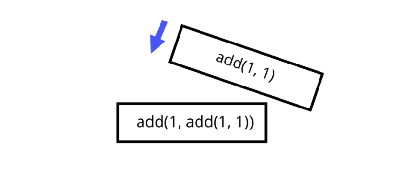

Lecture Video

No lecture video available. Coming soon!

---

# Lecture

## Why:

In JavaScript, a **function** is a block of code that does a particular task. Often while coding, you’ll find yourself writing the same code statements and expressions repetitively. Functions allow you to assign a block of code, even a subprogram in our project, to be called, or _invoked_, with a single identifier. The use of functions is a central concept in JavaScript programming.

**_Functions in JavaScript are first-class citizens/objects_**.

First-class functions give us a wide variety of flexible and powerful options; Design patterns let us write more readable, more dynamic, and more concise code. Some examples of use include **Asynchronous Functions and Higher-Order Functions.**

## What:

A function is a value that contains a block of code.

```
function isEven(n) {
    if(n < 0) {
        n = n * -1;
    }

    if(n === 0) {
        return true;
    } else if(n === 1) {
        return false;
    } else {
        return isEven(n - 2);
    }
}
```

Above is a function named _isEven_, that takes in a parameter named _n_ and evaluates _n_ through selection statements and returns a result. But wait, _isEven_ returns itself? Yes. Hold on to that thought. Functions can call other functions, including itself. This concept is key when structuring larger programs.

First-class functions can be:

- Stored in a variable.
- Passed as arguments of a function.
- Returned from a function.
- Hold their own properties.
- Be stored in data structures.

**_A [First-class function](https://en.wikipedia.org/wiki/First-class_citizen) is an object that supports all of the operations generally allowed to other objects_**. This includes being able to be assigned to a variable, passed around as a function argument, and being returned from a function.

Up until now, we’ve been using `console.log()` to print text to the browser console. This(console) is a built-in JavaScript object with a `.log()` function that takes in parameters, and prints them out in the web console.

```
function log(parameter) {
    // access the console to print parameter
}
```

JavaScript has many built-in functions that we can and will use. The best part about functions is that we can create new functions for solving an endless amount of problems.

## How:

Below is a glance at function syntax:

```
function functionName(parameters) {
    // function body with code to be executed
}
```

You can create functions in multiple ways:

1. Assigning the function to a variable

```
const printName = function(name) {
    console.log(name)
}
```

2. Or declaring a function

```
function printName(name) {
    console.log(name)
}
```

You define a function using the **_function _** keyword, followed by the function name, parentheses with **_parameters_**, and curly braces containing the function **_body_**.

Which way should you use? Either works, but there is a key difference. When you assign a function to a variable, you cannot call the function before you assign the variable. However, if you declare the function, the value is **_hoisted_**, and you can call the function before the function declaration.

Functions can contain multiple **parameters** or none at all. This is where JavaScript can be tricky. You can declare the function to receive 2 parameters. However, you are allowed to pass only 1 parameter, or 3. Or 10 or 20, even though you only declared the function to pass in 2. The extra params will not be used, and the params not passed in will be _undefined._ Lastly, you can initialize a parameter in the case that the param is not passed in:

```
function min(num1, num2) {
    if(num1 > num2) {
        return num2
    } else return num1;
}
```

You can write code in the function body to produce a **_side effect _**(body doesn’t return a value) or **_return a value._**

Above, the `min` function contains the **_return_ **keyword. This keyword breaks the control flow and returns a value as a result. The `min` function returns a number that is passed in as a parameter, depending on whether the condition is met.

Functions that produce **_side effects_** still return undefined.

Let’s take a minute to go over **_scope. _**Scope refers to the space inside where code is ‘visible’. We’ve mostly been working with **_global scope, _**which has made variables and values ‘visible’ within our entire program. There is also **_local scope_**, where variables and values inside the body of a function are only ‘visible’ within the confines of the function’s curly braces. For example:

```
let globalVariable = "G";

function countBs(str) {
    let Bs = 0;
    for(let i = 0; i < str.length; i++) {
        if(str[i] === "B") {
            Bs++;
        }
    }
    console.log(globalVariable); // outputs "G"
    return Bs;
}

console.log(Bs); // outputs "Bs is not defined
```

Above is a function that counts the number of ‘B’ letters in a given string. Inside the function, I declare a variable named ‘Bs’ and initialize it with the value 0. ‘Bs’ is only available inside the **_local scope_** of the ‘countBs’ function, while ‘globalVariable’ is available inside countBs’ scope. Pay attention to the relationship between scoped variables and values. In general, _you can access ‘outer’ values from the inside, but not ‘inner’ values from the outside._

\*Declaring variables with ‘var’ (which is pre ECMA2015) works differently. ‘Var’ variable declarations are considered global.

**_Closure_** involves a function that references bindings from local scopes around it

**_Recursion_** involves a function that calls itself. There are unique solutions that require recursive functions. Be mindful that this could very well end badly and crash your program/browser.

As of ECMA2015, you can use **_arrow notation_** to declare functions:

```
const min = (num1, num2) => {
    if(num1 > num2) {
        return num2
    } else return num1;
}
```

Now you have the option to drop the ‘function’ keyword and add the **_lambda expression_** after the parameter list, but before the function body (curly braces).

We’ve spent this whole time talking about declaring and defining functions, but what happens when you **_invoke_** or call a function?

When you invoke a function, the context of the function in the program is placed in the call stack. The **_call stack_** is the place where the computer stores the context, or position, as it runs the code. When a function is invoked, the context is stored in memory on the top of the stack, when the function returns. It uses that context to continue the execution of your program.



#### Functions can be used Asynchronously

A common use of first-class functions is when an asynchronous callback is necessary. This is often the case in web applications where some function must wait to be called until a server has returned some value or a promise has been fulfilled. _We will go into more detail when we reach Asynchronous Programming._

#### Functions can be used as Higher-Order Functions

A higher-order function is one that either has a function as a parameter or returns a function. In other words, higher-order functions do work on other functions. This practice allows you to abstract actions, not just values. _We will go into more detail when we reach the Higher-Order Functions section next._

## Exercise:

### Exercise 1: Print Odds Cont.

- In the past, we created a selection statement inside a loop that counted from 1 to 100 and only printed out the odd numbers.

- Your task is to write a function printOdds() that takes one parameter, count, and uses a loop and selection statement to count to the number passed in, printing out the odd numbers.

1. Declare a function named `printOdds` using declaration notation (`function &lt;name>(){...}`)

2. The function should take in one parameter named `count`

3. The function body should:

   - contain a `for loop` that counts to the parameter passed in,

   - an `if/else` statement that determines if the current value is odd,

   - and then `console.log()` the odd value to the console

BONUS: Now that you do not know exactly what number may be passed in as `count`, use an `if` statement to account for a negative `count` being passed in.

### Exercise 2: Legal?

- Write a function that receives a name and age, and prints a greeting message to the console using the name.

1. Declare a function named `checkAge` using declaration notation (`function &lt;name>(){...}`)

2. The function should take in two-parameter named `userName` & `age`

3. The function body should:

   - declare and initialize an `aboveSixteen` local variable with string value: `"Congrats ${userName}, you can drive!"`,

   - declare and initialize an `belowSixteen` local variable with string value: `"Sorry ${userName}, but you need to wait until you're 16."`,

   - an `if/else` statement that determines if the `age` value is below 16,

   - and then `console.log()` the correct message to the console.

4. BONUS: Remember that parameters are optional, and no `userName` or `age` value could be passed in. Correctly account for no parameter being passed in.

### More Practice:

- Assign a function to a variable

- Pass a function as a parameter(argument)

- Return a function from a function

[Exercise Walkthrough Documentation](https://docs.google.com/document/d/1Eyi0ESh0fTvSveKO2MbWr8bJ8-1JI9p9Sr9tUkx0Psg/edit?usp=sharing)

<video width="100%" height="auto" controls>
  <source src="https://vimeo.com/506290132/6a5bd742e8" type="video/mp4" />
</video>
