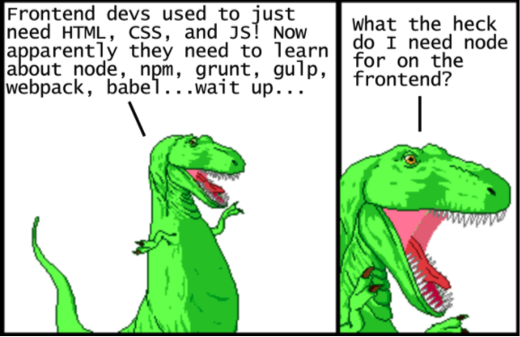

Lecture Video 1

<video width="100%" height="auto" controls>
  <source src="https://vimeo.com/truecodersio/review/510425628/fcc15e2ed0" type="video/mp4" />
</video>

Lecture Video 2

<video width="100%" height="auto" controls>
  <source src="https://vimeo.com/truecodersio/review/510436005/a49e95e076" type="video/mp4" />
</video>

# Lecture

## Why:

Why do we even need or want this stuff? What do you gain from all of this added complexity? These are good questions.. with good answers.

Starting around 2010, several competing JavaScript package managers emerged to help automate the process of downloading and upgrading libraries from a central repository. [Bower](https://bower.io/) was arguably the most popular in 2013, but eventually was overtaken by [npm](https://www.npmjs.com/) around 2015. (It’s worth noting that starting around late 2016, [yarn](https://yarnpkg.com/en/) has picked up a lot of traction as an alternative to npm’s interface, but it still uses npm packages under the hood.)

## What:

### npm

The node package manager is a command line tool that gives you access to a gigantic repository of plugins, libraries and tools. If you have done our Fundamentals course, you will probably have encountered it when you installed the Jasmine testing framework to do our exercises.

### Yarn

At some point, you will probably run into [Yarn](https://yarnpkg.com/en/) - a replacement for the default `npm`. For the most part, it does the same things though it _does_ have a few more features. Recent versions of `npm` have incorporated some of the best features of Yarn, so using it won’t offer you any real advantages at this point in your career. It _is_ a fine project, however, and may be worth your consideration in the future.

### Webpack

Webpack is simply a tool for bundling modules. There is a lot of talk across the net about how difficult and complex it is to set up and use, but at the moment our needs are few and the setup is simple enough. In fact, you can see an example of getting it up and running on the front page of [Webpack's website](https://webpack.js.org/).

Webpack _is_ a very powerful tool, and with that power comes a decent amount of complexity - just look at the sample config file on [Webpack's docs](https://webpack.js.org/configuration/) 😱. Don’t let it scare you off! The basic configuration is not difficult and proficiency with webpack looks _amazing_ on resumes.

## How:

### Downloading and installing packages locally using npm

You can install a package locally if you want to depend on the package from your own module, using something like Node.js require. This is npm install’s default behavior.

### Installing an unscoped package

Unscoped packages are always public, which means they can be searched for, downloaded, and installed by anyone. To install a public package, on the command line, run

`npm install <package_name>`

This will create the node_modules directory in your current directory (if one doesn’t exist yet) and will download the package to that directory.

Note: If there is no `package.json` file in the local directory, the latest version of the package is installed. If there is a `package.json` file, npm installs the latest version that satisfies the semver rule declared in `package.json`.

### Installed a scoped public package

Scoped public packages can be downloaded and installed by anyone, as long as the scope name is referenced during installation:

`npm install @scope/package-name`

### Installing a private package

Private packages can only be downloaded and installed by those who have been granted read access to the package. Since private packages are always scoped, you must reference the scope name during installation:

`npm install @scope/private-package-name`

### Testing package installation

To confirm that npm install worked correctly, in your module directory, check that a node_modules directory exists and that it contains a directory for the package(s) you installed:

`ls node_modules`

### Installed package version

If there is a `package.json` file in the directory in which npm install is run, npm install the latest version of the package that satisfies the semantic versioning rule declared in `package.json`

If there is no `package.json` file, the latest version of the package is installed.

### Installing a package with dist-tags

Like npm publish, `npm install <package_name>` will use the latest tag by default.

To override this behavior, use `npm install <package_name>@<tag>`. For example, to install the example-package at the version tagged with beta, you would run the following command:

`npm install example-package@beta`

## Exercise:

- Create a new folder
- Initialize npm in your new folder to create a `package.json` file
- Install a npm package of your choice (can be [dayjs](https://www.npmjs.com/package/dayjs) like our class walkthrough
- Create a `.gitignore` file, and have git ignore the newly created node_modules folder
- Practice using import / export statements to use the npm module in your `app.js` (or `index.js`) file

## Quiz:

**No Quiz!**
