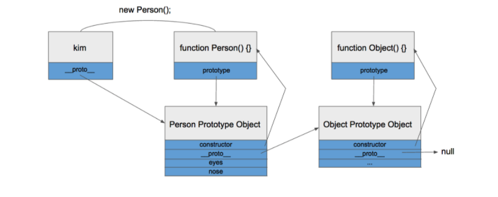

Lecture Video Part 1

<video width="100%" height="auto" controls>
  <source src="https://vimeo.com/507274745/d24c33169b#t=1458s" type="video/mp4" />
</video>

Lecture Video Part 2

<video width="100%" height="auto" controls>
  <source src="https://vimeo.com/507738547/d48e95d16b" type="video/mp4" />
</video>

# Lecture

## Why:

The concepts of **Object-oriented programming** have shaped the design of many programming languages, including JavaScript. Object-oriented programming aims at breaking a program into smaller pieces that interact with each other to perform tasks.

In object-oriented programming, different code blocks in your program interact with each other through **_interfaces_**. Interfaces are snippets of code that provide useful functionality at a more abstract level, keeping the bulk of the object hidden (especially parts of the object that I as a collaborator do not need to see or access when I interact with the object).

We have interacted with some of these interfaces already (i.e. array.length, array.map(), Math.round(), Date.getTime()). But you can create your own predefined objects as well.

## What:

### Methods

We’ve already learned that we can create an object:

```
const car = {
    type: "Fiat",
    model: "500",
    color: "red",
    drive: function () {
        return this.type + " is now in drive!";
    };
};

console.log(car.drive());
```

To review, **_methods are properties that hold function values._**

When you call methods on an object, you can access other object properties using **_this_** keyword. Above we defined a function value to the method variable **_drive_**. Declaring functions with the **_function_** keyword allows you to access it’s own binding value, whose value depends on the invocation.

We are allowed to use the **_this_** keyword above because it refers to the object from which it was called.

### Prototypes

A **_prototype_** is another object, a base object, that is used as a fallback with predefined properties and methods.

Object.prototype &lt;= Math.prototype, Object.prototype &lt;= Array.prototype, etc

The base object in JavaScript is the **_Object prototype_**. All objects that are based from the Object prototype share it’s properties and methods. You can override these properties or methods by defining them on a prototype object.



You use **_Object.create_** to create an object with a specific prototype:

```
const person = {
    name: undefined,
    age: undefined,
    speak() {
        console.log("Hello! " + "My name is " + this.name + " and I am " + this.age);
    };
};

const newPerson = Object.create(person);
newPerson.name = "Wilem";
newPerson.age = 23;
newPerson.speak();

// Hello! My name is Wilem and I am 23
```

The statement on line 25 would print out “Hello! My name is Wilem and I am 23”. Before 2015, the example above was how you would normally go about creating an object from a prototype, and assigning values to its properties.

### Classes

JavaScript prototypes are loose implementations on the object-oriented programming concept of **_classes._**

Classes are **_models of objects, with properties and methods_**

Objects created from a specific class are called **_instances_**

```
function makePerson(name, age) {
    const newPerson = Object.create(person);
    newPerson.name = name;
    newPerson.age = age;
    return newPerson;
};
```

## How

**_Constructor_** functions make sure that each instance of a class has the derived properties and methods. The function makePerson is a drawn-out example of what a constructor method does.

The makePerson method takes in two parameters that are used to initialize the objects properties. We use **_Object.create_** like before to create a new object from our ‘person’ prototype. We assign our parameters to their corresponding properties, and we return the newly created object.

Then, we can call the constructor function to create, assign, and return our object.

#### Class Notation

Since 2015, classes now have their own JavaScript notation common to other object-oriented programming languages. Now you can use the **_class _** and **_constructor _** keywords instead of the function route demonstrated above.

```
class Person {
    constructor(name, age) {
        this.name = name;
        this.age = age;
    }
    speak() {
        console.log(`Hello! My name is ${this.name} and I am ${this.age}.`);
    }
};

const newPersonFromClass = new Person("Wilem", 23);
newPersonFromClass.speak();

// Hello! My name is Wilem and I am 23
```

Use the **_new_** keyword before a function to signify a constructor. It is best practice to use uppercase naming for constructors (new **_Person()_** above^).

#### Pillars of Object-Oriented Programming in JavaScript (Briefly)

**_Abstraction_** is the concept of using ‘actions over values’. This allows you to step back from the minute details and design with a larger view/focus.

**_Encapsulation_** only uses parts of objects used in an interface. The properties and methods accessible from an object are public (available via the interface). All other details are private (hidden).

**_Polymorphism_** allows other types of objects to use an interface. This allows for any kind of object that uses an interface to use a method (think accessing properties and methods). For example, the **_Object.prototype_** has a **_toString()_** method that returns a string representation of the object.

```
const arr = [1, 2, 3];
console.log(arr.toString()); // 1,2,3
```

**_Inheritance_**defines a subclass with access to superclass properties and methods. This concept explains how each prototype points back to the **_Object.prototype_**. The **_Array.prototype_** inherits properties and methods from the **_Object. Prototype_**. Thus, we can access the **_Object. prototype.toString()_** method with an array.

```
class Coder extends Person {
    constructor(name, age) {
        super(name, age);
    };
    speak() {
        console.log(`Hello! My name is ${this.name} and I am a coder!`);
    }
}

const newCoder = new Coder("Simmon", 28);
newCoder.speak();

// Hello! My name is Simmon and I am a coder!
```

Here we created a class **_Coder_** that **_inherits_** from our **_Person_** class from earlier. Key things to notice when creating a class that inherits from a superclass:

- **_extends_** keyword after the class name, followed by the parent class
- **_super_** inside the **_Coders_**’ constructor method. The **_super_** method refers to the parent class’ constructor method
- We redefined the **_speak()_** method. This is referred to as **_method overriding_**

### Exercises

1. Use class notation to create a class named Person
2. Declare the constructor() method with parameters name (string), pets (number), residence (string), and hobbies (array) allowed to be passed in
3. The constructor() method assigns this. properties to each parameter
4. Declare an info() method on the class that console.log's a string giving information about the Person object
   - You should display the name, number of pets, residence, and each hobby from the hobbies array
5. Declare a greeting() method that console.log's the sound of a Person...
   - ex: `greeting() {console.log("Hello fellow person!")}`

Now we'll create a subclass Coder that inherits from our Person class

6. Use class notation to create a class named Coder that inherits from the Person class
7. Declare the constructor() method with parameters name (string), pets (number), residence (string), and hobbies (array) allowed to be passed in
8. Call the super() method inside the constructor method and pass in the given parameters
9. Still inside the constructor body, assign this.occupation to "Full Stack Web Developer"
10. Override the greeting() method to console.log a custom greeting from a coder…

Finally, let's create instances of our classes

11. Create a variable and assign a Person object to it using the new keyword followed by the class constructor
12. Create a variable and assign a Coder object to it using the new keyword followed by the class constructor
13. Call the object methods and console.log the object properties to test your work

### BONUS

1. Refactor the greeting() methods to accept a name parameter and uses in to personalize the greeting output
2. Now when you call the coder.greeting() or person.greeting() methods, you can pass in the name property from an instantiated Person or Coder object

Exercise Walkthrough:

<video width="100%" height="auto" controls>
  <source src="https://vimeo.com/507738666/2d3f4438d0" type="video/mp4" />
</video>

[Exercise Documentation Here](https://docs.google.com/document/u/1/d/1JVOKYhIp_LvdxP3hDZIrIBd2TIOFGj_0rOi0P7ll2-g/edit)

## Quiz:

No Quiz!
