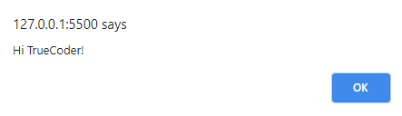

<!-- Lecture Video

<video width="100%" height="auto" controls>
  <source src="https://vimeo.com/507738803/cc3ff07589" type="video/mp4" />
</video>

--- -->

## Why

Do you know all those cool animations that you see around, that make you think to yourself, “Wow, I wish I could make something like that”? All of those animations are made by manipulating the DOM.

The **DOM** (Document Object Model) is a representation of your **HTML and XML** documents that are interpreted by your browser. It allows a language (in our case **JavaScript**) to manipulate the style and structure of our website. After the browser reads our **HTML** document, it creates a representational tree, called the _Document Object Model_, and defines how that tree can be accessed.

## What

### Elements

The **DOM of an HTML document** can be represented as a nested set of boxes (nodes).

These nodes have certain relations to other nodes! For example, in our tree data structure (pictured below), if a node falls in a level below, yet directly correlated to the node above, then it’s known as a _CHILD_ node. Where the node that those elements fall underneath, is the _PARENT_ node. If two elements fall on the same level, then they’re known as _SIBLING_ nodes.


For the example above:

- **HTML** is a child of the **DOCUMENT** node. **HTML** then has two children nodes **HEAD** and **BODY**. Those nodes then have child nodes **TITLE** belonging to **HEAD**, and **H1** **A** belonging to **BODY**.
- Nodes can have different relations when referred to at different times. For example, the **BODY** node is a child node in relation to the **HTML** node, yet it’s a parent in relation to the **H1** and **A** nodes!
- The **DOM** represents our document as a **tree data structure** or as a hierarchy of elements.
- HTML elements become interrelated **nodes** in the tree.
- All those nodes in the tree have some kind of relation to each other.
- Nodes can have **child** nodes, and nodes on the same tree level are called **sibling** nodes!

### The Document Object

In JavaScript there is a predefined **Document** object, which allows us to access all of the elements on the **DOM**. Which makes the **Document** Object the owner/root of all the objects in our **DOM**.

To access something from the **DOM**, you’ll always start by accessing the `document` object, followed by whatever element you’re trying to access.

For example:

```js
document.body.innerHTML = "<main><h1>Hello World!</h1></main>";
```

Since `body` is an element of the **DOM**, we can grab it using the `document` object. Then we use the `innerHTML` property to change the content of the `body` element!

> Note that changing the `innerHTML` of the `body` element will overwrite whatever you have nested in `body` element.

## How

### Selecting Elements

We can select HTML elements on the DOM in multiple ways:

- `getElementById()` - returns one element based on the id we pass as a parameter
- `getElementsByClassName()` - returns multiple elements based on the classname we pass as a parameter
- `getElementsByTagName()` - returns multiple elements based on the tagname we pass as a parameter
- `querySelector()` - returns the first element that matches the css selector we pass as a parameter
- `querySelectorAll()` - returns multiple elements that match the css selector we pass as a parameter

The `getElementsByClassName()` method returns an array of all child elements in the document with the same class name passed in as the parameter.

```js
const header = document.getElementsByClassName("header");
header[0]; // HTMLElement
```

Here we have a variable named `headers` that contains the value of `document.getElementsByClassName(“header”)`.

Keep in mind that `getElementsByClassName()` will return an array of all child elements that have the class name of `"header"`. We’ll need to reference the index of the element in the `headers` array that we want to change.

Similarly, the `getElementsByTagName()` method returns all of the elements of the specified tag name as an array.

However, these arrays are known as **live arrays**, meaning the contents of the arrays are updated with the contents of the **DOM tree** automatically.

The following example gets all paragraph elements of the page and changes their content:

```js
const pElements = document.getElementsByTagName("p");
for (let ele of pElements) {
  ele.textContent = "We were found by our tag name";
}
```

The script above grabs all of the `p` elements in the DOM. Then loops through the array returned, and changes each element’s `textContent` to "We were found by our tag name!".

### Changing Attributes

You can also change the attributes of html elements.

Just as we changed the text content of html elements by assigning `innerHTML` or `textContent` properties, we can assign new values to attributes.

For example, you can change the `checked` attribute of an `input`:

```js
const input = document.getElementById("checkbox");
input.checked = true;
```

You can also change the **href** attribute of a link:

```js
const link = document.getElementById("#homeLink");
link.href = "https://truecoders.io";
```

### Creating Elements

You can create new DOM elements with the following methods:

- `createElement(tagname)` - the most common way of creating elements
- `createTextNode(text)` - used only for creating a node element
- `cloneNode()` - used for cloning an existing element

We can use `createElement` below to create a new heading 1 element.

```js
let h1 = document.createElement("h1");
```

Awesome! But our newly created elements will not show up on the DOM until we `append` them to the document. We can use the following methods to add elements to the DOM:

- `appendChild(element)` - appends a new element at the end of the DOM tree
- `insertBefore(newElement, childElement)` - inserts a new element before the specified element

```js
let h1 = document.createElement("h1");
let parent = document.querySelector(".parentDiv");
parent.appendChild(h1);
```

### Removing Elements

You can remove an HTML element by selecting the parent of the element and using `removeChild(element)`.

For example:

```js
let h1 = document.querySelector("h1");
let parent = document.querySelector(".parentDiv");
parent.removeChild(h1);
```

This removes the `h1` from the document.

### Replacing Elements

To replace an HTML element, the `replaceChild(newNode, oldNode)` method is used.

For example:

```js
let h1 = document.querySelector("h1");
let h2 = document.createElement("h2");
h2.textContent = "I'll replace the h1";
let parent = document.querySelector(".parentDiv");
parent.replaceChild(h2, h1);
```

### Animations

Now that we have the basics of DOM manipulation in our repertoire, we can start creating animations!

Let’s start simple. We’re going to dynamically manipulate the position of a box inside of another box.

This will go inside of your body tag:

```html
<div id="container">
  <div id="box"></div>
</div>
```

This will go inside of your css document:

```css
#container {
  width: 250px;
  height: 250px;
  background: lightblue;
  position: relative;
}

#box {
  width: 75px;
  height: 75px;
  background: burlywood;
  position: absolute;
}
```

Our container element is represented by the bigger light blue square, while the box is the smaller burlywood square located in the top left corner of our container. The position of the container is set to [relative](https://css-tricks.com/absolute-relative-fixed-positioining-how-do-they-differ/#relative) which limits the scope of the absolutely positioned (burlywood) box inside the container. Allowing us to animate the box relative to its container.

Our goal will be to animate the box to move from the left side of the container to the right side.

For us to create an animation, we have to manipulate the properties of our box element in small intervals of time. For us to do that, we need to first define the time in which our box will move. We can use the `setInterval(callBack(), time)` method, which allows us to create a timer, and accepts a callback function to execute each time the specified time is reached. The one thing to keep in mind is that the time is going to be read in milliseconds, so 500ms is the equivalent of half a second. 1000ms is the equivalent of 1 second, and so on.

For example:

```js
let timer = setInterval(move, 100);
```

The example above utilizes the `setInterval()` method, and is accepting a callback function named move (which we’ve yet to create), and is going to execute every tenth of a second. Next we need to define our move function.

```js
function move() {
  boxPosition++;
  box.style.left = boxPosition + "px";
}
```

Now if we look at this live in the browser, we might notice a tiny bug. The box starts moving, moving, moving….but never stops. We need the box to stop when it hits the edge of our container. Let’s introduce a condition that measures the box’s position and stops it when it hits the border. We need to keep in mind that the box itself is created from the top left corner of itself, to the bottom right corner of itself. This means that we can’t just simply check if it hit the border, because it will fall right outside of the container. We need to take the box’s width, and subtract it from the container’s width. Leaving us with 175 in this instance. Inside the condition body that’s checking the position of the box, we’ll introduce the `clearInterval(var)` method, which will stop the execution of our timer.

```js
function move() {
  if (boxPosition >= 175) {
    clearInterval(timer);
  } else {
    boxPosition++;
    box.style.left = boxPosition + "px";
  }
}
```

When the left attribute of our box reaches 175, the timer will stop executing, therefore finishing our animation!

#### The final code

```js
let timer = setInterval(move, 100);

let boxPosition = 0;

let box = document.querySelector("#box");

function move() {
  if (boxPosition >= 175) {
    clearInterval(timer);
  } else {
    boxPosition++;
    box.style.left = boxPosition + "px";
  }
}
```

> NOTE: CSS3 has introduced many new and useful components to styling a webpage, including `@keyframes`, `transition`, `transform` and more for creating animations.

### Events

#### Handling Events

Next let’s look at events. Event’s are things that happen when a certain action is taken or a condition is met. The action that is performed when one of these actions or conditions is met is known as the event handler. Check the list below for a list of common events.

- `onclick` - occurs when the user clicks on an element.
- `onload` - occurs when an object has loaded.
- `onunload` - occurs once a page has unloaded (for `<body>`).
- `onchange` - occurs when the content of a form element, the selection, or the checked state have changed. (for `<input>`, `<keygen>`, `<select>`, and `<textarea>`).
- `onmouseover` - occurs when the pointer is moved onto an element, or onto one of its children.
- `onmouseout` - occurs when a user moves the mouse pointer off of an element or out of one of its children.
- `onmousedown` - occurs when the user presses a mouse button over an element.
- `onmouseup` - Occurs when a user releases a mouse button over an element.
- `onblur` - occurs when an element loses focus.
- `onfocus` - occurs when an element gets focus.

Let's display an alert popup when the user clicks a specified button:

```html
<button onclick="displayAlert()">Alert</button>
<script>
  function displayAlert() {
    alert("Hello TrueCoder!");
  }
</script>
```



We can also assign event handlers to elements. First we assign an element to a variable using one of the selection methods. Then we use dot notation to specify an event (`element.onclick`) then assign a function to it.

For example:

```html
<button id="btn">Alert</button>
<script>
  function displayAlert() {
    alert("Hello TrueCoder!");
  }

  let btn = document.querySelector("#btn");
  btn.onclick = displayAlert;
</script>
```

#### More on Events

The `onload` event is triggered when the user loads the page to their browser. The opposite is true for the `onunload` event. These can be useful when performing actions after the page is loaded.

If you want something to execute after the whole page is loaded, use the `window.onload` event!

The `onchange` event is mostly used on textboxes. The event handler gets called when the text inside the textbox changes and focus is lost from the element.

For example:

```html
<p id="display"></p>
<input id="name" />
<script>
  function updateDisplay(event) {
    document.querySelector("#display").textContent = event.target.value;
  }

  let name = document.querySelector("#name");
  name.onchange = updateDisplay;
</script>
```

For inputs, we can access the data the user enters with the `value` property on the element. Also, if you add an `onchange` event listener that handles each `change` event for the input, we can access the input element as the `event.target` as seen above.

#### `addEventListener`

We can use the `addEventListener()` method to attach multiple event handlers to one element.

We can also add multiple event handlers of the same type. For example, we can have two event handlers that execute onclick!

```js
element.addEventListener("click", () =>
  alert("Hello World from the alert box")
);

element.addEventListener("click", () =>
  console.log("Hello World from the console")
);
```

The first parameter in the `addEventListener()` method is the type of Event that’s being “listened” for. The Second parameter is the event handler/callback function that executes when the event is triggered.

## Takeaways

1. DOM stands for _Document Object Model_
2. The global _document_ object has methods and properties for accessing the DOM
3. Events are triggered by the DOM and can be _listened_ to and _handled_ by functions
