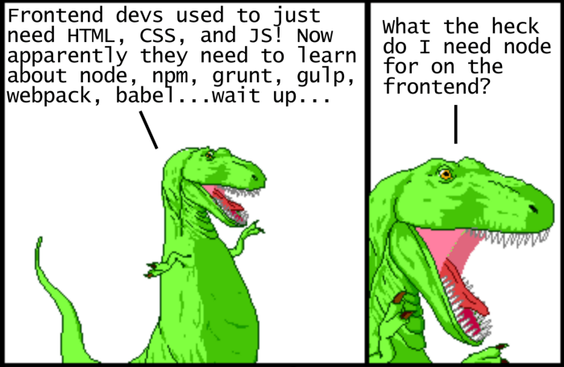

## Why



Why do we even need or want this stuff? What do you gain from all of this added complexity? These are good questions.. with good answers.

Starting around 2010, several competing JavaScript package managers emerged to help automate the process of downloading and upgrading libraries from a central repository. [Bower](https://bower.io/) was arguably the most popular in 2013, but eventually was overtaken by [npm](https://www.npmjs.com/) around 2015. (It’s worth noting that starting around late 2016, [yarn](https://yarnpkg.com/en/) has picked up a lot of traction as an alternative to npm’s interface, but it still uses npm packages under the hood.)

## What

### NPM

The **node package manager** is a command line tool that gives you access to a gigantic repository of plugins, libraries and tools.

### Yarn

At some point, you will probably run into [Yarn](https://yarnpkg.com/en/) - a replacement for the default `npm`. For the most part, it does the same things though it _does_ have a few more features. Recent versions of `npm` have incorporated some of the best features of Yarn, so using it won’t offer you any real advantages at this point in your career. It _is_ a fine project, however, and may be worth your consideration in the future.

### Webpack

[Webpack](https://www.theodinproject.com/courses/javascript/lessons/es6-modules#webpack) is simply a tool for bundling modules. There is a lot of talk across the net about how difficult and complex it is to set up and use, but at the moment our needs are few and the setup is simple enough. In fact, you can see an example of getting it up and running on the front page of [their website](https://webpack.js.org/).

Webpack _is_ a very powerful tool, and with that power comes a decent amount of complexity - just look at this sample [config file](https://webpack.js.org/configuration/) 😱. Don’t let it scare you off! The basic configuration is not difficult and proficiency with webpack looks _amazing_ on resumes.

## How

When dealing with packages from npm, it's important to have a `package.json` file. To initialize npm in your repository, run `npm init` in a new directory. This command will initialize the creation of a `package.json` file in your directory, and ask you basic questions, such as "author:", "description:", "keywords:", "main:", "license:", etc.

> To accept the default configuration answers, you can instead run `npm init -y`.

We can install dependencies for our project using the `npm install` CLI tool.

### Downloading and installing packages locally using npm

You can install a package locally if you want to use it in your project

### Installing an unscoped package

Unscoped packages are always public, which means they can be searched for, downloaded, and installed by anyone. To install a public package, on the command line, run

```sh
npm install <package_name> --save
```

This will create the `node_modules` directory in your current directory (if one doesn’t exist yet) and will download the package to that directory.

> Note: If there is no `package.json` file in the local directory, the latest version of the package is installed. If there is a `package.json` file, npm installs the latest version that satisfies the [semver rule](https://nodesource.com/blog/semver-tilde-and-caret/) declared in `package.json` under the property "dependencies:".

### Installed a scoped public package

Scoped public packages can be downloaded and installed by anyone, as long as the scope name is referenced during installation:

```sh
npm install @scope/package-name
```

### Installing a private package

Private packages can only be downloaded and installed by those who have been granted read access to the package. Since private packages are always scoped, you must reference the scope name during installation:

```sh
npm install @scope/private-package-name
```

### Testing package installation

To confirm that npm install worked correctly, in your module directory, check that a node_modules directory exists and that it contains a directory for the package(s) you installed:

```sh
ls node_modules
```

### Installed package version

If there is a `package.json` file in the directory in which npm install is run, npm install the latest version of the package that satisfies the semantic versioning rule declared in `package.json`

If there is no `package.json` file, the latest version of the package is installed.

### Installing a package with dist-tags

Like npm publish, `npm install <package_name>` will use the latest tag by default.

To override this behavior, use `npm install <package_name>@<tag>`. For example, to install the example-package at the version tagged with beta, you would run the following command:

```sh
npm install example-package@beta
```

### Webpack Setup

To use import/export statements in our code, and to bundle and minify our assets, we need to set up Webpack. There is quite a bit of configuration that we can add to our projects, but we'll begin with the minimum configuration for getting started.

In a project folder initialized with npm, install webpack and webpack-cli npm packages as development dependencies.

```sh
npm install webpack webpack-cli --save-dev
```

Add two new folders, `dist/` and `src/`, in the root of your project that will be targets for webpack input and output. Also, create an `index.js` file in your `src/` folder.

Add a `webpack.config.js` file in the root directory with the following:

```js
const path = require("path");

module.exports = {
  mode: "development",
  entry: "./src/index.js",
  output: {
    path: path.resolve(__dirname, "dist"),
    filename: "main.js",
  },
};
```

This basic configuration tells webpack to target the `./src/index.js` as the entrypoint for bundling, and `./dist/main.js` as the output file.

Lastly, in your `package.json` file, add the following line to your `"scripts": {...}` value:

```json
{
  // ...
  "scripts": { "build": "webpack" }
}
```

Now, we can bundle our project to test with `npm run build` on the command line.

## Takeaways

1. Modern web development involves code bundling and asset management tools such as _Webpack_ and _npm_
2. _NPM_ is a registry with millions of JavaScript code packages that you can use in your project
3. _Webpack_ is a tool for bundling and minifying your project assets, which makes your overall shipped code base as small and efficient as possible
