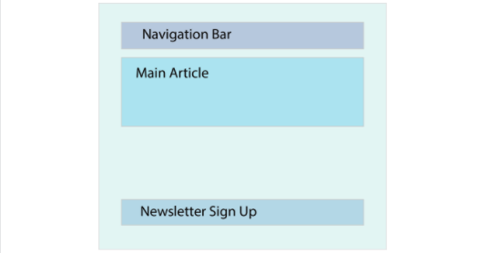

Lecture Video

<video width="100%" height="auto" controls>
  <source src="https://vimeo.com/truecodersio/review/510436774/3b57480035" type="video/mp4" />
</video>

Lecture Video 2

<video width="100%" height="auto" controls>
  <source src="https://vimeo.com/truecodersio/review/510881202/f8287a451e" type="video/mp4" />
</video>


## Why:

React is one of the most powerful and widely used frontend libraries.

The landscape for frontend frameworks has been changing a lot over the last few years, so it is understandable to be “scared” of going for the “wrong” one. However, once you start diving deeper into React, you will love it. It makes your code easily scalable, more readable, and possibly a thousand times more efficient (just our modest estimation).

Just to name a few reasons on why to learn React.js:

- Reusability of components
- Well supported, due to its popularity
- React is unopinionated, which means that it won’t force you to follow any specific patterns or logic, it’s all up to you.
- Smaller learning curve, especially when you already have a good grasp of JavaScript and HTML from our previous lessons.

## What

Applications built with React are made with (reusable) components. Components are your “building blocks” in React. To gain confidence using React, you should learn to divide your application or project into separate components. The following picture gives you an idea of how to do that with a very basic app.



For example, this simple website could be divided into the following sections (components):

- `App`, which represents your main application and will be the parent of all other components.
- `Navbar`, which will be the navigation bar
- `MainArticle`, which will be the component that renders your content.
- `NewsletterForm`, which is a simple form that let’s a user input his email to receive the weekly newsletter

In React, each component is an ES6 module. ES6 (ECMA2015) introduced the import statement; you can `import` components into other components like so: `import ExampleComponent from "./components/ExampleComponent"`. This allows us to write each component as its own module in a separate file and later import all modules to the file that contains them. (In our case that would be App.js)

In the beginning, it might be a little bit difficult to figure out the best component structure, especially when state and props come into play. This topic will be discussed in the following sections. For now, don’t worry too much about the component structure, understanding of best practices comes with experience. React components, in general, can and usually do have parent or child components. This system of structuring your applications helps to keep your code structured and makes it easy to keep track of your components’ relationships with each other.

To give you an example of a basic component, see the following code:

```
import React, { Component } from "react";

class App extends Component {
    constructor() {
        super()
    }

    {/* Other JavaScript logic */}

    render() {
        return (
            <div className="App">Hello World!</div>
        )
    }
}
```

Does the code look foreign? Don’t worry, the structure isn’t as difficult as it may look. Let’s walk through it step by step.

```
import React, { Component } from "react";
```

With the above import statement, we are importing React and the Components module from the React library, which allows us to create a class component. If you are wondering why we have to wrap Component into curly brackets and not React, this is due to the way they are exported from the React module. Default exports are imported without curly brackets; everything else must be wrapped in curly brackets. Don’t worry about this too much as we will get plenty of exposure to import and export statements soon.

```
class App extends Component {
    {/* Some logic */}
}
```

Secondly, we are declaring the class component, which is just a JavaScript class that extends the Component class we imported earlier. One thing to notice is that React components should always be declared with a capital letter at the beginning. This is a naming convention used by most developers and recommended by the React core team at Facebook.

```
constructor() {
    super()
}
```

Next is the constructor. A constructor is not obligatory in a class component, but you will most likely encounter one because it becomes important when concepts like inheritance and state are involved (to get used to seeing it, it has been included here). You will usually see developers passing `props` as an argument to the constructor and also to the `super()` call, which must be called in any constructor. However, you will not learn about props here. This concept will be discussed further in the next lesson. The idea here is to expose you to the terminology that we will be using in the future.

This syntax may look weird at first, but it is nothing more than a simple comment. In React, you write comments within curly brackets and /\* \*/. There are sections of React components where the comments (denoted by //) we are used to are permissible. For now, we’ll leave that as an exercise for you.

```
render() {
    return (
        <div className="App">Hello World!</div>
    )
}
```

The most unfamiliar code is likely the `render()` function, which returns something that looks like HTML, but is actually JSX. One of the primary characteristics and features of React is the ability to combine JavaScript and JSX. JSX is an HTML-like syntax that will be transpiled into JavaScript so a browser will be able to process it. One thing you should know about JSX is that you can’t use the HTML protected words, such as class or `onchange`. Instead of `class` you write `className` and instead of `onchange` you write `onChange`. In general, all attributes in JSX are written in camelCase. You should be fairly familiar with that naming convention from the naming of variables in JavaScript. The `render()` function you see is the most used React lifecycle function (more on that in an upcoming section). The only thing you should know for now is that every React class component needs a render function, which returns _one_ JSX element. So whatever you want to return needs to be wrapped in a single parent element.

Finally, to be able to reuse this `App` component we created in other files of our project, we have to export the component. In our example, we export the component as the file’s default export:

```
export default App;
```

If you have multiple components in one file, you could export each component separately by adding the export keyword before the declaration of the component. However, if you export a component as a default, you can import it without wrapping curly brackets around it. If you export multiple components, you have to import them inside of curly brackets.

So far, so good! We have already learned a lot about components in React, and let me tell you, class components are just one way of defining components. In React, another way is to use functional components.

A basic functional component looks like this:

```
import React from "react";

const App = () => {
    return <div className="App">Hello World!</div>;
};

export default App;
```

As you can see, there are a couple of differences between functional and class based components.

1. We don’t have to import and extend “Component” from React;
2. We don’t need a constructor.
3. We don’t need the render function, but instead a return statement

There are more differences, which we will encounter when discussing props and state.

## How

### Create-react-app

Developers at Facebook came up with a great tool called create-react-app, which sets up a complete React application for you. By running one command, it does all the necessary setup and configuration for you to immediately start working on your project.

First, go to your desktop in your command prompt or terminal

Then, run `mkdir react` and then cd into that folder

Then, go ahead and run `npx create-react-app my-first-react-app` in your cmd prompt or terminal.

You're going to see a ton of activity in your cmd prompt/terminal after running that command. Let it finish before moving on

<samp>
We suggest that you begin by typing:

    cd my-first-react-app
    npm start

Happy Hacking!
</samp>

Now it’s done!

`cd` into the project by typing `cd my-first-react-app`, and then open it in your text editor (visual studio code). If you want, you can view the project in the browser via the command `npm start`.


### Index.js and App.js

Two of the most important files create-react-app includes for you are index.js and App.js. index.js is the entry point of your application by default. Open up your index.js file and check out this line:

`ReactDOM.render(<App />, document.getElementById('root'))`

In short, what this line of code does is tells React to render the App component into the DOM, exactly into the element with the id “root”. Every create-react-app project has a root div, which is visible in the index.html file in your public directory. That means, should you decide to name your main application component different from App.js, make sure to change the index.js as well.

## Exercise

Use the steps below to help with the exercise

1. Use the create-react-app &lt;app-name> command in your cmd prompt/terminal
2. After the app is done initializing, cd into that folder and start the application using npm start
3. Open the app you created in visual studio code and open the App.js file
   1. Now add a h1 tag that says My First React
   2. Add a p tag with a sentence or two with your first impressions of React
4. Reload the site

(To terminate the React Development environment use ‘Control + c’ in the terminal)

[Exercise Walkthrough Documentation](https://docs.google.com/document/d/1toNzn9MTuxG66ZZL5ZEFitYZ8gSy3Lh9_4W2f3PJfN8/edit?usp=sharing)

## Quiz

[React Intro Quiz](https://docs.google.com/forms/d/e/1FAIpQLScPSFScofwU-OoiU6UroaRVJAWTK4fMvXaXYvjKUkytr6oCkw/viewform)
