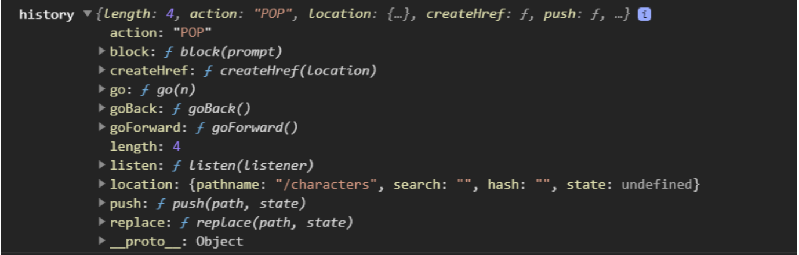
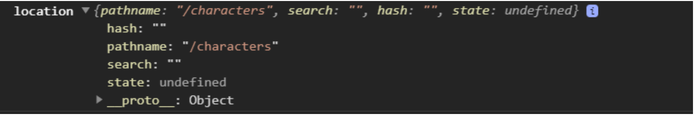
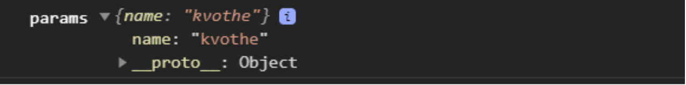
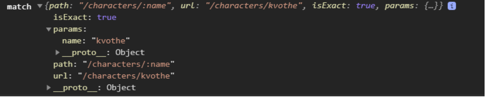
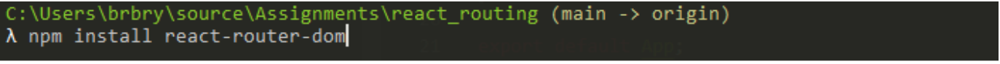

Lecture Video

<video width="100%" height="auto" controls>
  <source src="https://vimeo.com/truecodersio/review/511784716/81ba606ccf" type="video/mp4" />
</video>

---

# Lecture

## Why:

With React Router, we can create navigation to different webpages by adding routes, a switch, and a BrowserRouter. React Router ships with a few hooks that let you access the state of the router and perform navigation from inside your components.

## What:

There are four primary router hooks we can use:

- `useHistory`
- `useLocation`
- `useParams`
- `useRouteMatch`

We should recognize these four as React hooks by their naming conventions: **use.** Let’s dive into each one.

### useHistory

The `useHistory` hook allows you to access the history instance. You can then use this information to navigate to previous pages.

Here’s a look at the history instance:



We can use several useful functions from the history instance.

- `goBack()` - navigates to the previous page
- `goForward()` - navigates to the page after the current in the history trace
- `push(<new_route>)` - navigates to the passed in route endpoint

### useLocation

The `useLocation` hook allows you to access the location object that represents the current URL.

Let’s take a look at the location object.



You can use the `useLocation` hook whenever you need to track pathname changes in your web application.

### useParams

The `useParams` hook allows you to access the key/value pairs of URL parameters. You can use this to access match.params of the current route inside your component.

First, let’s add a parameter to my route:

```
<Route path="/characters/:name">
  <Home />
</Route>
```

Let’s take a look at the match object:



Now I can use the useParam hook to access match.name:

```
const { name } = useParams();
```

### useRouteMatch

The `useRouteMatch` hook allows you to access the params for a URL in the same way that a `useParams` would. The difference is that `useRouteMatch` gives you access to match data without actually rendering a route component.

We can either pass in a route string to be matched by the hook, or not pass any parameter, letting the hook return the match data for the current url:

```
const match = useRouteMatch();

// OR

const matchWithParam = useRouteMatch("/character/:name");
```

Let’s take a look at match object from `useRouteMatch`:



Here, we can access the params object to use name, but we also have the path and matched url to use.

## How

Let’s go through it step by step.

We need to make sure the `react-router-dom`module is installed:



Next we need to go to `App.jsx` and import our Browser router, and then wrap everything in our App component with the BrowserRouter component:

```
import { BrowserRouter } from "react-router-dom";
```

```
return (
  <BrowserRouter>

  </BrowserRouter>
)
```

Next we need to register our Routes inside of the Switch component, which means to tell React which components to render based on the given routes, so in `App.jsx` add the `Switch` and `Route` components to the import statement:

```
import { BrowserRouter, Switch, Route } from "react-router-dom";
```

And we’ll add our router components in the return statement:

```
return (
  <BrowserRouter>
    <Navbar />
    <Switch>
      <Route path="/characters/:name">
        <CharacterView />
      </Route>
      <Route path="/characters">
        <CharacterList />
      </Route>
      <Route path="/">
        <Welcome />
      </Route>
    </Switch>
  </BrowserRouter>
)
```

Now, let’s create our CharacterList and CharacterView components.

In my `CharacterList.jsx`

```
import * as React from "react";
import { useHistory } from "react-router-dom";

const CharacterList = () => {
  const [characterList, setCharacterList] = React.useState([]);
  const [filterList, setFilterList] = React.useState([]);

  const history = useHistory();

  React.useEffect(() => {
    if(characterList.length === 0) {
      fetchCharacters();
    }
  }, []);

  const fetchCharacters = () => {
    fetch("https://benjaminrbryant.com/api/v1/characters", {mode: "cors"})
      .then((res) => res.json())
      .then((res) => {
        const { list } = res;
        setCharacterList(list);
        setFilterList(list);
      })
      .catch((err) => console.log(err));
  }

  ...
}
```

Import the hooks you’ll need for this component (`useState`, `useEffect`, `useHistory`). I use my state hook to track both my list of characters and my filtered list of characters.

Create a fetch method that handles your Fetch API request, and sets the character list state to the data from the response.

```
const handleSearchInput = (e) => {
  const updatedList = characterList.filter((character) => character.name.includes(e.target.value));
  setFilteredList(updatedList);
}
```

Similar to our previous lesson on a basic filter by name, I’ve added a function to filter my list of characters depending on the name inputted by the user.

Then, I render my filtered list to the ReactDOM in my return statement for my `CharacterList.jsx` component.

```
return (
  <main className="container text-center">
    <button className="btn btn-info" onClick={() => history.goBack()}>Back</button>
    <h1>Characters</h1>
    <input type="text" className="input-group" onChange={handleSearchInput} placeholder="Search Character..."/>
    <hr />
    <ul className="list-group-flush">
      {filteredList.map((character, index) => {
        return (
          <li className="list-group-item" key={character.name + index}>
            <h4>{character.name}</h4>
          </li>
        )
      })}
    </ul>
)
```

Next, let’s fill out our `CharacterView.jsx`:

```
import * as React from "react";
import {useHistory, useParams} from "react-router-dom";

const CharacterView = () => {
  const [character, setCharacter] = React.useState({});

  const history = useHistory();

  const { name } = useParams();

  useEffect(() => {
    if(character.name === undefined) {
      fetchCharacter();
    }
  }, [])

  ...
}
```

Instead of calling the api to receive the list of all characters, I just want the data for the specific character based on the url params:

```
const fetchCharacters = () => {
  fetch(`https://benjaminrbryant.com/api/v1/characters/${name}`, {mode: "cors"})
    .then((res) => res.json())
    .then((res) => {
      setCharacter(res);
    })
    .catch((err) => console.log(err));
  }
```

You can use the useParams hook to use the match object, and apply the url param to the api call for a specific request.

```
return (
  <main className="container text-center">
    <button className="btn btn-info" onClick={() => history.goBack()}>Back</button>
    <div className="card">
      <h1>{character.name}</h1>
    </div>
  </main>
)
```

And to finish up, I display the name (and will add more information) about the specific character this page is detailing.

## Exercise

The API we will be using: [Studio Ghibli API](https://ghibliapi.herokuapp.com/#section/Studio-Ghibli-API)

This will be a continuation from the React Routing Exercise.

### Getting Started

- Open your command line and navigate to your repos directory (if you do not have a repos folder, then you can use mkdir repos to create one)
- Use this template repository to start a new project in your repos folder: `git clone <repo_name>` cd `repo_name` to navigate into your new repo directory
- Make sure to run npm install to fetch the dependencies for the project
- Start Visual Studio Code and select 'Open Folder'. Then select `repo_name` to open the folder in the editor (or just type code . in your terminal inside the repo directory)
- Follow the instructions on the `README.md` file to complete exercises
- Open the `App.jsx` file to get started

### Steps

- We will be using the Studio Ghibli API to make calls, and display data in our application, depending on our current url route.
- [Studio Ghibli API](https://ghibliapi.herokuapp.com/#section/Studio-Ghibli-API)
- For each of the endpoints that you created earlier with routes to display the data:
  - Create new components for individually displaying each value of data in the lists you’ve displayed
  - Add new routes to display these components when a route url is matched, using the data id as params
- Create individual components for at least three datasets (e.g. people, places, vehicles, etc)
- You should be able to click on a film, character, etc from your list page that takes you to the view page for the item that was selected.

Exercise Walkthrough Video

<video width="100%" height="auto" controls>
  <source src="https://vimeo.com/513161607/9b14f4ac7c" type="video/mp4" />
</video>

## Quiz:

No Quiz!
