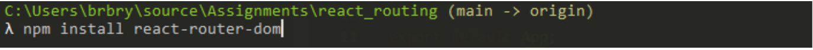

Lecture Video 1

<video width="100%" height="auto" controls>
  <source src="https://vimeo.com/512688952/cf667b10f7" type="video/mp4" />
</video>

Lecture Video 2

<video width="100%" height="auto" controls>
  <source src="https://vimeo.com/513159042/c08596be42" type="video/mp4" />
</video>

---

# Lecture

## Why

**React Router** is a standard library for **routing in React**. It enables the navigation among views of various components in a **React** Application, allows changing the browser URL, and keeps the UI in sync with the URL

In this lecture we are going to learn a little bit about routing in React. Up until now we have only written one-page applications. Once your application has multiple pages, you need to set up a reliable routing system. This is to handle the component or page that should be rendered when navigating to a certain route. For this we are going to use a package called `react-router-dom`.

## What

There are three primary categories of components in React Router:

- routers, like `<BrowserRouter>` and `<HashRouter>`
- route matchers, like `<Route>` and `<Switch>`
- and navigation, like `<Link>`, `<NavLink>`, and `<Redirect>`

You can think of the navigation components as “route changers”.

All of the components that you use in a web application should be imported from `react-router-dom`.

### Routers

At the core of every React Router application should be a router component. React-router-dom provides two routers: `<BrowserRouter>` and `<HashRouter>`. The main difference between the two is the way they store the URL and communicate with your server.

- `<BrowserRouter>` Create React App supports this out of the box in development, and comes with instructions on how to configure your production server as well. The key is that your server should match the same URL destinations as your frontend.
- `<HashRouter>` Hash router stores the current location in the hash portion of the URL, and the hash is never sent to the server.

To use a router, just make sure it is rendered at the root of your element hierarchy.

### Route Matchers

We use Switch and Route to match routes. When a `<Switch>` is rendered, it searches through its children `<Route>` elements to find one whose path matches the current URL. When it finds one, it renders that `<Route>` and ignores all others. If no `<Route>` matches, the `<Switch>` renders nothing (null).

Note that `<Route path>` is satisfied when it matches any part of the URL from the beginning, not the whole thing. So a `<Route path="/">` will always match the URL. It is best practice to put this `<Route>` last in our `<Switch>`. We can also use `<Route exact path="/">` which forces an exact URL match.

Note: Although you can render `<Route>` elements outside of a `<Switch>`, it is not recommended unless you were to use the useRouteMatch hook instead.

### Navigating with Links

React Router provides a `<Link>` component to create links in your application. Wherever you render a `<Link>`, an anchor (`<a>`) will be rendered in your HTML document.

The `<NavLink>` is a special type of `<Link>` that can style itself as “active” when its prop matches the current location.

Any time that you want to force navigation, you can render a `<Redirect`>. When a `<Redirect`> renders, it will navigate using its to prop.

## How

Let’s go through it step by step. Create a new react app and let’s begin!:

The first thing we need to do is install `react-router-dom`



Next we need to go to App.jsx and import our Browser router, and then wrap everything in our App component with the BrowserRouter component:

```
import { BrowserRouter } from "react-routing-dom";
```

```
return (
    <BrowserRouter>

    </BrowserRouter>
)
```

Next we need to register our Routes inside of the Switch component, which means to tell React which components to render based on the given routes, so in App.js:

```
import { BrowserRouter, Switch, Route } from "react-router-dom";
```

and

```
<BrowserRouter>
    <Navbar />
    <Switch>
        <Route path="/users">
            <Users />
        </Route>
        <Route path="/admin">
            <Admin />
        </Route>
        <Route path="/">
            <Home />
        </Route>
    </Switch>
</BrowserRouter>
```

Now, start the application to see it in the browser, use the url bar to test that the router is working!

#### Exact attribute

But if you notice, your Home component continues to stay rendered below the other components, so let's fix that with the exact attribute added to the Home route:

```
<Route exact path="/">
    <Home />
</Route>
```

### Link component

Next, we're going to go to our Navbar.jsx, and we want to import and use { Link } from our react router dom. The biggest thing that this will fix, this is more important in larger enterprise applications, is that each time we click a new page to go to, it wont reload the bundle.js every time. So in Navbar.jsx:

```
import { Link } from "react-router-dom";
```

```
<li>
    <Link to="/">Home</Link>
</li>
<li>
    <Link to="/users">Users</Link>
</li>
<li>
    <Link to="/admin">Admin</Link>
</li>
```

### Route Props and Passing Props

Now let’s pass some props to our routes.

```
<Route>
    <Users title="Users Rule"/>
</Route>
<Route>
    <Admin title="Admin Rule"/>
</Route>
<Route>
    <Home title="Welcome Rule"/>
</Route>
```

---

## Exercise

Repo Link: [React Routing](https://github.com/Bryantellius/react_routing)

The API we will be using: [Studio Ghibli API](https://ghibliapi.herokuapp.com/#section/Studio-Ghibli-API)

### Getting Started

- Open your command line and navigate to your repos directory (if you do not have a repos folder, then you can use mkdir repos to create one)
- Use this template repository to start a new project in your repos folder: `git clone <repo_name>` cd repo_name to navigate into your new repo directory
- Make sure to run npm install to fetch the dependencies for the project
- Start Visual Studio Code and select 'Open Folder'. Then select repo_name to open the folder in the editor (or just type code . in your terminal inside the repo directory)
- Follow the instructions on the `README.md` file to complete exercises
- Open the `App.jsx` file to get started

### Steps

- We will be using the Studio Ghibli API to make calls, and display data in our application, depending on our current url route.
- [Studio Ghibli API](https://ghibliapi.herokuapp.com/#section/Studio-Ghibli-API)
- We'll be fetching from the /films and /people endpoints for this exercise

1. Configure React Router in your application. Use the same structure as the walkthrough during the lecture. Just make sure that it works!

- Reminder `BrowserRouter` is the starting point:

```
<BrowserRouter>
    <Switch>
        <Route>
            <Component />
        </Route>
    </Switch>
</BrowserRouter>
```

2. Create a Navbar component. Import and then render the component in the App component (not inside the Switch)
3. Next, you should create three Links that point to a specific Route url. One for Home, another for Films, and a third for People
4. Start configuring your first route.

- Say, for `/films`. After navigating to [localhost:3000/films](localhost:3000/films), you should see Studio Ghibli's list of films.
- The data should only be loaded and displayed when you navigate to `/films`. You should use `componentDidMount()` and fetch to make this request.
- You will use ["https://ghibliapi.herokuapp.com/films"]("https://ghibliapi.herokuapp.com/films") for the api endpoint
- Construct a fetch request with .then and .catch. Remember to:
  - Fetch the data
  - If a response was resolved, parse the JSON object
  - Then set the response to the state of your Films component
  - In your render method, be sure to map through the films state and display the results to the browser

5. Configure your second route. Repeat the steps from the `/films` route, but for `/people`. Use ["https://ghibliapi.herokuapp.com/people"]("https://ghibliapi.herokuapp.com/people").

- At the end of these tasks, you should have at least three pages in your application, and you should be able to navigate to them simply by clicking a link.

## Bonus

- Create two more routes for /places and /vehicles.

[Exercise Walkthrough Documentation](https://docs.google.com/document/d/1J3yBfPOQNLgN_HvJhoD0U3trlS9gG5dJTbYMnsGFtUY/edit?usp=sharing)

Exercise Walkthrough Video

<video width="100%" height="auto" controls>
  <source src="https://vimeo.com/513160454/6cc127ac7d" type="video/mp4" />
</video>

---

## Quiz:

No Quiz!
