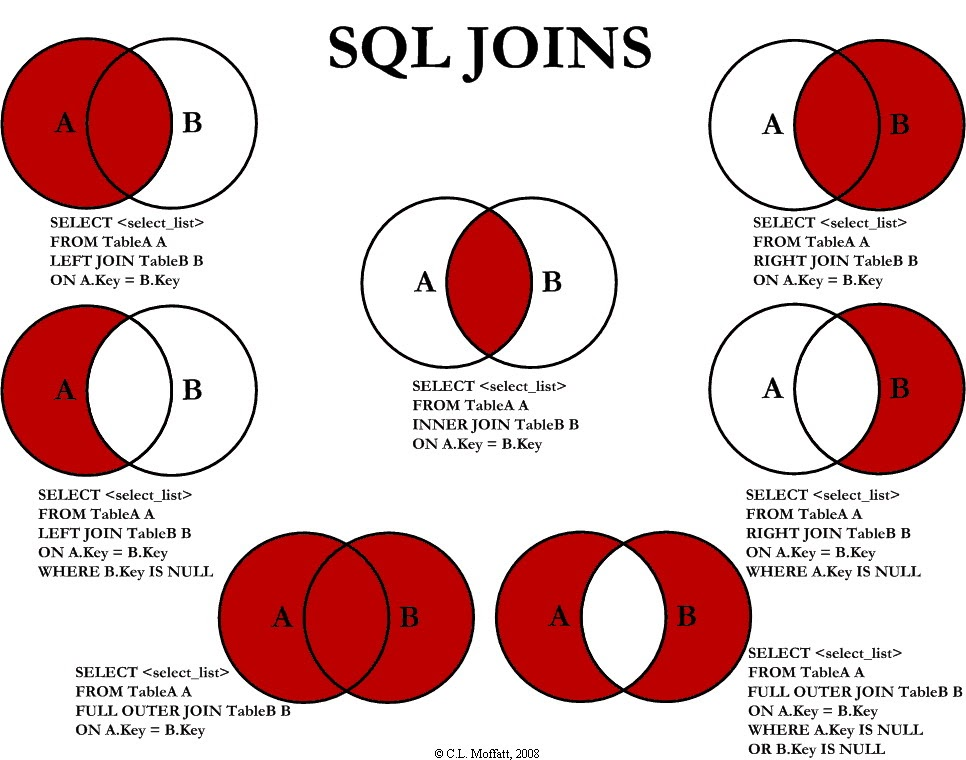
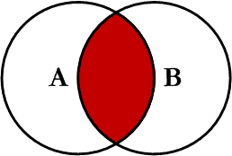
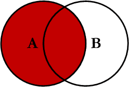
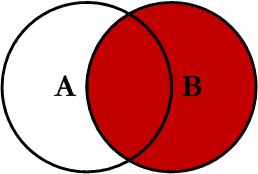
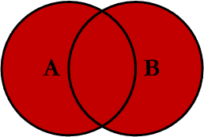
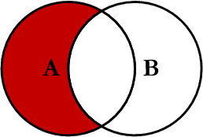
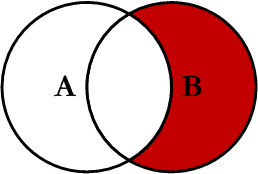
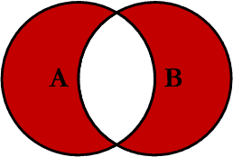

Combining multiple tables is where the real power of SQL lives. SQL can combine multiple tables on criteria that match and report them as one result set. That is where a JOIN clause comes in.

A JOIN clause is used to combine rows from two or more tables, based on a related column between them. Here are several Venn diagrams showing the visual representation of the different Joins available:



While the majority of your joins will tend to be `INNER` or `LEFT` join statements, we will go over all the joins available to you:

## INNER JOIN

The `INNER JOIN` statement in SQL gets only the records where a match occurs on both tables. The result set looks like this:



The `INNER JOIN` statement follows this syntax:

```sql
SELECT column_name(s)
FROM tableA
INNER JOIN tableB ON tableA.column_name = tableB.column_name;

-- Returns customer names and order IDs
-- only where the Orders.CustomerID matches the Customers.CustomerID
SELECT Orders.OrderID, Customers.CustomerName
FROM Orders
INNER JOIN Customers ON Orders.CustomerID = Customers.CustomerID;
```

## LEFT JOIN

The `LEFT JOIN` statement in SQL gets all the records from the left table and only records from the right table where a match occurs. The result set looks like this:



The `LEFT JOIN` statement follows this syntax:

```sql
SELECT column_name(s)
FROM tableA
LEFT JOIN tableB ON tableA.column_name = tableB.column_name;

-- Returns all customer names and includes the order ID record
-- if the Orders.CustomerID matches the Customers.CustomerID
SELECT Customers.CustomerName, Orders.OrderID
FROM Customers
LEFT JOIN Orders ON Customers.CustomerID = Orders.CustomerID
ORDER BY Customers.CustomerName;
```

## RIGHT JOIN

The `RIGHT JOIN` statement in SQL gets all the records from the right table and only records from the left table where a match occurs. The result set looks like this:



The `RIGHT JOIN` statement follows this syntax:

```sql
SELECT column_name(s)
FROM tableA
RIGHT JOIN tableB ON tableA.column_name = tableB.column_name;

-- Returns all customer names and includes the order ID record
-- if the Orders.CustomerID matches the Customers.CustomerID
SELECT Customers.CustomerName, Orders.OrderID
FROM Orders
RIGHT JOIN Customers ON Customers.CustomerID = Orders.CustomerID
ORDER BY Customers.CustomerName;
```

> NOTE: Although Right Join is available to you, industry standard/best practice is to use a Left Join instead.

## FULL OUTER JOIN

The `FULL OUTER JOIN` statement in SQL gets all the records from both the left and right tables where a match occurs in either table. The result set looks like this:



The `FULL OUTER JOIN` statement follows this syntax:

```sql
SELECT column_name(s)
FROM tableA
FULL OUTER JOIN tableB ON tableA.column_name = tableB.column_name;

-- Returns all customer names and order ID record
-- where the Orders.CustomerID matches the Customers.CustomerID
SELECT Customers.CustomerName, Orders.OrderID
FROM Customers
FULL OUTER JOIN Orders ON Customers.CustomerID = Orders.CustomerID
ORDER BY Customers.CustomerName;
```

> NOTE: Although Full Outer Join is available to you, there are very few cases where this Join will be required.

## LEFT EXCLUDING JOIN

The `LEFT EXCLUDING JOIN` statement in SQL gets all the records from the left table where a match does not occur on the right table. The result set looks like this:



The `LEFT EXCLUDING JOIN` statement follows this syntax:

```sql
SELECT column_name(s)
FROM tableA
LEFT JOIN tableB ON tableA.column_name = tableB.column_name
WHERE tableB.column_name IS NULL;

-- Returns all customer names if the Orders.CustomerID is Null
SELECT Customers.CustomerName
FROM Customers
LEFT JOIN Orders ON Customers.CustomerID = Orders.CustomerID
WHERE Orders.CustomerID IS NULL;
```

## RIGHT EXCLUDING JOIN

The `RIGHT EXCLUDING JOIN` statement in SQL gets all the records from the right table where a match does not occur on the left table. The result set looks like this:



The `RIGHT EXCLUDING JOIN` statement follows this syntax:

```sql
SELECT column_name(s)
FROM tableA
RIGHT JOIN tableB ON tableA.column_name = tableB.column_name
WHERE tableA.column_name IS NULL;

-- Returns all customer names if the Orders.CustomerID is Null
SELECT Customers.CustomerName
FROM Orders
RIGHT JOIN Customers ON Customers.CustomerID = Orders.CustomerID
WHERE Orders.CustomerID IS NULL;
```

> NOTE: Although Right Excluding Join is available to you, industry standard/best practice is to use a Left Excluding Join instead.

## FULL OUTER EXCLUDING JOIN

The `FULL OUTER EXCLUDING JOIN` statement in SQL gets all the records from both the left and right tables where a match does not occur in either table. The result set looks like this:



The `FULL OUTER EXCLUDING JOIN` statement follows this syntax:

```sql
SELECT column_name(s)
FROM tableA
FULL OUTER JOIN tableB
ON tableA.column_name = tableB.column_name
WHERE tableA.column_name IS NULL OR tableB.column_name IS NULL;

-- Returns all customer names
-- where a match doesn't occur in either Orders or Customers tables
SELECT Customers.CustomerName
FROM Customers
FULL OUTER JOIN Orders ON Customers.CustomerID = Orders.CustomerID
WHERE Customers.CustomerID IS NULL OR Orders.CustomerID IS NULL;
```

> NOTE: Although Full Outer Excluding Join is available to you, there are very few cases where this Join will be required.

## Takeaways

1. _JOINS_ combine results from multiple tables based on _relationships_
2. _LEFT JOIN_ pulls all results from the left table and only matched results from the right table
3. _INNER JOIN_ only pulls results where matches are found on both left and right tables
